# Pipeline de Agentes IA para Desarrollo Autónomo de Workflows

## Concepto: Multi-Agent Development Pipeline

### Arquitectura del Sistema
```mermaid
graph A --> B
```



```mermaid
graph TD
    A[Usuario: Solicitud de cambio] --> B[Agente Especificación]
    B --> C[Agente Código]
    C --> D[Agente Testing Básico]
    D --> E[Agente Deployment]
    E --> F[Agente Validación QA]
    F --> G{¿Validación OK?}
    G -->|Sí| H[Producción]
    G -->|No| I[Rollback + Feedback]
    I --> B
    
    subgraph "Pipeline Autónomo"
        B
        C
        D
        E
        F
    end
    
    subgraph "Integración Continua"
        J[GitHub Actions]
        K[Temporal Server]
        L[Testing Environment]
        M[Blue/Green Deployment]
    end
    
    C --> J
    E --> M
    F --> L
```

## 1. Agente de Especificación

### Responsabilidades
- Interpretar requisitos del usuario en lenguaje natural
- Crear especificaciones técnicas detalladas
- Generar criterios de aceptación
- Crear plan de testing funcional

```go
type SpecificationAgent struct {
    llmClient      *openai.Client
    domainKnowledge *WorkflowDomainKB
    specStorage    SpecificationStorage
    userContext    *UserContext
}

type WorkflowSpecification struct {
    ID                  string                 `json:"id"`
    UserRequest         string                 `json:"user_request"`
    TechnicalRequirements []Requirement       `json:"technical_requirements"`
    AcceptanceCriteria  []AcceptanceCriterion `json:"acceptance_criteria"`
    TestPlan           *TestPlan             `json:"test_plan"`
    RiskAssessment     *RiskAssessment       `json:"risk_assessment"`
    Dependencies       []string              `json:"dependencies"`
    EstimatedComplexity string               `json:"estimated_complexity"` // "low", "medium", "high"
    GeneratedAt        time.Time             `json:"generated_at"`
}

type Requirement struct {
    ID          string   `json:"id"`
    Type        string   `json:"type"`        // "functional", "non-functional", "constraint"
    Description string   `json:"description"`
    Priority    string   `json:"priority"`   // "must", "should", "could"
    Rationale   string   `json:"rationale"`
    Verification string  `json:"verification"` // Cómo verificar que se cumple
}

type AcceptanceCriterion struct {
    ID          string `json:"id"`
    Given       string `json:"given"`       // Precondiciones
    When        string `json:"when"`        // Acción
    Then        string `json:"then"`        // Resultado esperado
    Measurable  bool   `json:"measurable"`  // ¿Se puede medir automáticamente?
}

func (agent *SpecificationAgent) ProcessUserRequest(request string) (*WorkflowSpecification, error) {
    // 1. Análisis del contexto y dominio
    context := agent.analyzeUserContext(request)
    
    // 2. Generación de especificación técnica via LLM
    prompt := agent.buildSpecificationPrompt(request, context)
    
    llmResponse, err := agent.llmClient.CreateChatCompletion(context.Background(), 
        openai.ChatCompletionRequest{
            Model: openai.GPT4,
            Messages: []openai.ChatCompletionMessage{
                {
                    Role:    openai.ChatMessageRoleSystem,
                    Content: agent.getSystemPrompt(),
                },
                {
                    Role:    openai.ChatMessageRoleUser,
                    Content: prompt,
                },
            },
            MaxTokens: 2000,
            Temperature: 0.3, // Más determinístico para especificaciones
        })
    
    if err != nil {
        return nil, fmt.Errorf("LLM specification generation failed: %w", err)
    }
    
    // 3. Parsear respuesta estructurada
    spec, err := agent.parseSpecificationResponse(llmResponse.Choices[0].Message.Content)
    if err != nil {
        return nil, fmt.Errorf("specification parsing failed: %w", err)
    }
    
    // 4. Validación y enriquecimiento
    spec = agent.enrichSpecification(spec, context)
    
    // 5. Generar plan de testing
    spec.TestPlan = agent.generateTestPlan(spec)
    
    // 6. Evaluación de riesgos
    spec.RiskAssessment = agent.assessRisks(spec)
    
    return spec, nil
}

func (agent *SpecificationAgent) getSystemPrompt() string {
    return `You are a senior business analyst and technical architect specializing in Temporal.io workflows.

Your task is to convert user requests into detailed technical specifications for workflow modifications.

For each request, provide:

1. TECHNICAL REQUIREMENTS:
   - Break down the request into specific, implementable requirements
   - Classify as functional, non-functional, or constraints
   - Assign priority (must/should/could)
   - Include rationale and verification method

2. ACCEPTANCE CRITERIA:
   - Write testable Given/When/Then scenarios
   - Focus on measurable outcomes
   - Cover happy path and edge cases

3. RISK ASSESSMENT:
   - Identify potential issues
   - Rate impact and probability
   - Suggest mitigation strategies

4. DEPENDENCIES:
   - List required activities, external systems, or data
   - Identify breaking changes

Output must be valid JSON following the WorkflowSpecification schema.

Current system context:
- Temporal.io purchase approval workflows
- Go implementation with external auth integration
- Blue/green deployment capability
- E2E testing with Playwright

Be specific, measurable, and implementation-focused.`
}
```

## 2. Agente de Código

### Responsabilidades
- Implementar especificación técnica en código Go
- Mantener consistencia arquitectónica
- Seguir patrones de Temporal.io
- Generar tests unitarios

```go
type CodeAgent struct {
    llmClient       *openai.Client
    codebase        *CodebaseAnalyzer
    templateEngine  *CodeTemplateEngine
    validator       *CodeValidator
    gitClient       *GitClient
}

type CodeImplementation struct {
    SpecificationID string                 `json:"specification_id"`
    GeneratedFiles  []GeneratedFile       `json:"generated_files"`
    ModifiedFiles   []ModifiedFile        `json:"modified_files"`
    TestFiles       []GeneratedFile       `json:"test_files"`
    BuildCommands   []string              `json:"build_commands"`
    Dependencies    []string              `json:"dependencies"`
    BranchName      string                `json:"branch_name"`
    CommitHash      string                `json:"commit_hash"`
    GeneratedAt     time.Time             `json:"generated_at"`
}

type GeneratedFile struct {
    Path        string `json:"path"`
    Content     string `json:"content"`
    Type        string `json:"type"`        // "workflow", "activity", "test", "config"
    Language    string `json:"language"`    // "go", "yaml", "json"
    LineCount   int    `json:"line_count"`
}

func (agent *CodeAgent) ImplementSpecification(spec *WorkflowSpecification) (*CodeImplementation, error) {
    log.Printf("🤖 Code Agent: Starting implementation for spec %s", spec.ID)
    
    // 1. Analizar codebase actual
    currentState, err := agent.codebase.AnalyzeCurrentState()
    if err != nil {
        return nil, fmt.Errorf("codebase analysis failed: %w", err)
    }
    
    // 2. Crear branch para el desarrollo
    branchName := fmt.Sprintf("feature/ai-generated-%s", spec.ID)
    err = agent.gitClient.CreateBranch(branchName)
    if err != nil {
        return nil, fmt.Errorf("branch creation failed: %w", err)
    }
    
    // 3. Generar implementación vía LLM
    implementation, err := agent.generateImplementation(spec, currentState)
    if err != nil {
        return nil, fmt.Errorf("code generation failed: %w", err)
    }
    
    // 4. Validar código generado
    validationResult, err := agent.validator.ValidateGenerated(implementation)
    if err != nil {
        return nil, fmt.Errorf("code validation failed: %w", err)
    }
    
    if !validationResult.IsValid {
        // Intentar corrección automática
        corrected, err := agent.correctCodeIssues(implementation, validationResult.Issues)
        if err != nil {
            return nil, fmt.Errorf("code correction failed: %w", err)
        }
        implementation = corrected
    }
    
    // 5. Escribir archivos al filesystem
    err = agent.writeGeneratedFiles(implementation)
    if err != nil {
        return nil, fmt.Errorf("file writing failed: %w", err)
    }
    
    // 6. Commit cambios
    commitHash, err := agent.gitClient.CommitChanges(
        fmt.Sprintf("🤖 AI Generated: %s\n\nSpecification ID: %s\nGenerated files: %d\nModified files: %d", 
            spec.UserRequest, spec.ID, len(implementation.GeneratedFiles), len(implementation.ModifiedFiles)))
    
    if err != nil {
        return nil, fmt.Errorf("git commit failed: %w", err)
    }
    
    implementation.BranchName = branchName
    implementation.CommitHash = commitHash
    implementation.GeneratedAt = time.Now()
    
    log.Printf("✅ Code Agent: Implementation completed. Branch: %s, Commit: %s", branchName, commitHash)
    
    return implementation, nil
}

func (agent *CodeAgent) generateImplementation(spec *WorkflowSpecification, currentState *CodebaseState) (*CodeImplementation, error) {
    prompt := fmt.Sprintf(`Generate Go code implementation for this workflow specification:

SPECIFICATION:
%s

CURRENT CODEBASE STATE:
- Existing workflows: %v
- Existing activities: %v  
- Current patterns: %s
- Architecture: %s

REQUIREMENTS:
1. Generate complete, compilable Go code
2. Follow existing patterns and architecture
3. Include comprehensive error handling
4. Generate corresponding unit tests
5. Use Temporal.io best practices
6. Maintain backward compatibility

OUTPUT FORMAT:
Provide a JSON response with:
- generated_files: New files to create
- modified_files: Existing files to modify  
- test_files: Unit test files
- build_commands: Commands to build/test

Each file should include complete content, not just snippets.`,
        agent.specToString(spec),
        currentState.Workflows,
        currentState.Activities,
        currentState.Patterns,
        currentState.Architecture)

    // Llamada al LLM con context window grande
    response, err := agent.llmClient.CreateChatCompletion(context.Background(),
        openai.ChatCompletionRequest{
            Model:       "gpt-4-32k", // Usar modelo con más contexto
            Messages: []openai.ChatCompletionMessage{
                {
                    Role:    openai.ChatMessageRoleSystem,
                    Content: agent.getCodeGenerationSystemPrompt(),
                },
                {
                    Role:    openai.ChatMessageRoleUser,
                    Content: prompt,
                },
            },
            MaxTokens:   8000,
            Temperature: 0.2, // Muy determinístico para código
        })

    if err != nil {
        return nil, fmt.Errorf("LLM code generation failed: %w", err)
    }

    // Parsear respuesta JSON
    implementation, err := agent.parseImplementationResponse(response.Choices[0].Message.Content)
    if err != nil {
        return nil, fmt.Errorf("implementation parsing failed: %w", err)
    }

    return implementation, nil
}
```

## 3. Agente de Testing Básico

### Responsabilidades
- Ejecutar tests unitarios generados
- Verificar compilación
- Ejecutar smoke tests
- Validar compatibilidad con codebase existente

```go
type BasicTestingAgent struct {
    testRunner    *TestRunner
    compiler      *GoCompiler
    temporalEnv   *TestTemporalEnvironment
    validator     *CodeValidator
}

type TestResult struct {
    ImplementationID string              `json:"implementation_id"`
    CompilationOK    bool                `json:"compilation_ok"`
    UnitTestsOK      bool                `json:"unit_tests_ok"`
    SmokeTestsOK     bool                `json:"smoke_tests_ok"`
    CoveragePercent  float64             `json:"coverage_percent"`
    TestOutput       string              `json:"test_output"`
    Issues           []TestIssue         `json:"issues"`
    ExecutionTime    time.Duration       `json:"execution_time"`
    TestedAt         time.Time           `json:"tested_at"`
}

type TestIssue struct {
    Type        string `json:"type"`        // "compilation", "test_failure", "coverage"
    Severity    string `json:"severity"`     // "error", "warning", "info"
    File        string `json:"file"`
    Line        int    `json:"line"`
    Message     string `json:"message"`
    Suggestion  string `json:"suggestion,omitempty"`
}

func (agent *BasicTestingAgent) TestImplementation(impl *CodeImplementation) (*TestResult, error) {
    log.Printf("🧪 Testing Agent: Starting tests for implementation %s", impl.SpecificationID)
    
    result := &TestResult{
        ImplementationID: impl.SpecificationID,
        TestedAt:        time.Now(),
    }
    
    startTime := time.Now()
    
    // 1. Test de compilación
    log.Printf("🔨 Testing compilation...")
    compilationResult, err := agent.compiler.Compile(impl.GeneratedFiles, impl.ModifiedFiles)
    if err != nil {
        result.Issues = append(result.Issues, TestIssue{
            Type:     "compilation",
            Severity: "error",
            Message:  fmt.Sprintf("Compilation failed: %v", err),
        })
        result.CompilationOK = false
    } else {
        result.CompilationOK = true
        log.Printf("✅ Compilation successful")
    }
    
    if !result.CompilationOK {
        result.ExecutionTime = time.Since(startTime)
        return result, nil // No continuar si no compila
    }
    
    // 2. Tests unitarios
    log.Printf("🧪 Running unit tests...")
    unitTestResult, err := agent.testRunner.RunUnitTests(impl.TestFiles)
    if err != nil {
        result.Issues = append(result.Issues, TestIssue{
            Type:     "test_failure",
            Severity: "error",
            Message:  fmt.Sprintf("Unit tests failed: %v", err),
        })
        result.UnitTestsOK = false
    } else {
        result.UnitTestsOK = unitTestResult.AllPassed
        result.CoveragePercent = unitTestResult.Coverage
        result.TestOutput = unitTestResult.Output
        log.Printf("✅ Unit tests passed: %d/%d, Coverage: %.1f%%", 
            unitTestResult.Passed, unitTestResult.Total, unitTestResult.Coverage)
    }
    
    // 3. Smoke tests
    log.Printf("💨 Running smoke tests...")
    smokeTestResult, err := agent.runSmokeTests(impl)
    if err != nil {
        result.Issues = append(result.Issues, TestIssue{
            Type:     "smoke_test",
            Severity: "error", 
            Message:  fmt.Sprintf("Smoke tests failed: %v", err),
        })
        result.SmokeTestsOK = false
    } else {
        result.SmokeTestsOK = smokeTestResult.Passed
        log.Printf("✅ Smoke tests passed")
    }
    
    result.ExecutionTime = time.Since(startTime)
    
    // 4. Generar reporte
    agent.generateTestReport(result)
    
    log.Printf("🏁 Testing completed in %v. Compilation: %v, Unit: %v, Smoke: %v", 
        result.ExecutionTime, result.CompilationOK, result.UnitTestsOK, result.SmokeTestsOK)
    
    return result, nil
}

func (agent *BasicTestingAgent) runSmokeTests(impl *CodeImplementation) (*SmokeTestResult, error) {
    // 1. Configurar entorno temporal de testing
    testEnv := agent.temporalEnv.CreateTestEnvironment()
    defer testEnv.Cleanup()
    
    // 2. Registrar workflows y activities generados
    err := testEnv.RegisterImplementation(impl)
    if err != nil {
        return nil, fmt.Errorf("failed to register implementation: %w", err)
    }
    
    // 3. Ejecutar workflow básico
    workflowRun, err := testEnv.ExecuteWorkflow("test-workflow-run", nil)
    if err != nil {
        return nil, fmt.Errorf("workflow execution failed: %w", err)
    }
    
    // 4. Verificar que el workflow se ejecuta sin errores críticos
    var result interface{}
    err = workflowRun.Get(context.Background(), &result)
    if err != nil {
        return nil, fmt.Errorf("workflow result failed: %w", err)
    }
    
    return &SmokeTestResult{
        Passed:        true,
        ExecutionTime: workflowRun.GetRuntime(),
        Result:        result,
    }, nil
}
```

## 4. Agente de Deployment

### Responsabilidades
- Orquestar deployment blue/green
- Configurar routing selectivo
- Monitorear métricas de deployment
- Ejecutar rollback automático si es necesario

```go
type DeploymentAgent struct {
    k8sClient      kubernetes.Interface
    temporalClient temporal.Client
    monitoring     *MetricsCollector
    alerting       *AlertManager
    config         *DeploymentConfig
}

type DeploymentResult struct {
    ImplementationID   string              `json:"implementation_id"`
    DeploymentID      string              `json:"deployment_id"`
    BuildID           string              `json:"build_id"`
    BlueGreenState    string              `json:"blue_green_state"` // "blue", "green"
    RoutingPercentage float64             `json:"routing_percentage"`
    HealthStatus      string              `json:"health_status"`
    Metrics           *DeploymentMetrics  `json:"metrics"`
    RollbackRequired  bool                `json:"rollback_required"`
    DeployedAt        time.Time           `json:"deployed_at"`
}

func (agent *DeploymentAgent) DeployImplementation(impl *CodeImplementation, testResult *TestResult) (*DeploymentResult, error) {
    log.Printf("🚀 Deployment Agent: Starting deployment for %s", impl.SpecificationID)
    
    // 1. Verificar que los tests pasaron
    if !testResult.CompilationOK || !testResult.UnitTestsOK || !testResult.SmokeTestsOK {
        return nil, fmt.Errorf("cannot deploy: tests failed")
    }
    
    // 2. Generar Build ID único
    buildID := fmt.Sprintf("ai-generated-%s-%d", impl.SpecificationID, time.Now().Unix())
    
    // 3. Build y push de imagen Docker
    log.Printf("🐳 Building Docker image...")
    err := agent.buildAndPushImage(impl, buildID)
    if err != nil {
        return nil, fmt.Errorf("docker build failed: %w", err)
    }
    
    // 4. Determinar color de deployment (blue/green)
    currentColor, err := agent.getCurrentColor()
    if err != nil {
        return nil, fmt.Errorf("failed to determine current color: %w", err)
    }
    
    newColor := "green"
    if currentColor == "green" {
        newColor = "blue"
    }
    
    // 5. Deploy a ambiente inactivo (blue/green)
    log.Printf("🎨 Deploying to %s environment...", newColor)
    err = agent.deployToEnvironment(impl, buildID, newColor)
    if err != nil {
        return nil, fmt.Errorf("deployment to %s failed: %w", newColor, err)
    }
    
    // 6. Health check del nuevo deployment
    log.Printf("🏥 Running health checks...")
    healthy, err := agent.waitForHealthy(buildID, newColor)
    if err != nil {
        return nil, fmt.Errorf("health check failed: %w", err)
    }
    
    if !healthy {
        agent.cleanupFailedDeployment(buildID, newColor)
        return nil, fmt.Errorf("deployment failed health checks")
    }
    
    // 7. Configurar routing inicial (10%)
    log.Printf("🎯 Configuring initial routing (10%)...")
    err = agent.configureRouting(buildID, 10.0)
    if err != nil {
        return nil, fmt.Errorf("routing configuration failed: %w", err)
    }
    
    // 8. Iniciar monitoreo de métricas
    go agent.monitorDeployment(buildID)
    
    deploymentResult := &DeploymentResult{
        ImplementationID:   impl.SpecificationID,
        DeploymentID:      fmt.Sprintf("deploy-%s", buildID),
        BuildID:           buildID,
        BlueGreenState:    newColor,
        RoutingPercentage: 10.0,
        HealthStatus:      "healthy",
        DeployedAt:        time.Now(),
    }
    
    log.Printf("✅ Deployment successful. Build: %s, Color: %s, Routing: 10%%", buildID, newColor)
    
    return deploymentResult, nil
}

func (agent *DeploymentAgent) monitorDeployment(buildID string) {
    ticker := time.NewTicker(30 * time.Second)
    defer ticker.Stop()
    
    log.Printf("📊 Starting deployment monitoring for %s", buildID)
    
    for {
        select {
        case <-ticker.C:
            metrics, err := agent.monitoring.CollectMetrics(buildID)
            if err != nil {
                log.Printf("❌ Metrics collection failed: %v", err)
                continue
            }
            
            // Verificar métricas de salud
            if agent.shouldRollback(metrics) {
                log.Printf("🚨 Metrics indicate rollback needed for %s", buildID)
                agent.executeEmergencyRollback(buildID)
                return
            }
            
            // Incrementar routing gradualmente si métricas son buenas
            if agent.shouldIncreaseTraffic(metrics) {
                newPercentage := agent.calculateNextPercentage(metrics.CurrentPercentage)
                log.Printf("📈 Increasing traffic to %.1f%% for %s", newPercentage, buildID)
                agent.configureRouting(buildID, newPercentage)
            }
            
        case <-time.After(30 * time.Minute):
            // Timeout de monitoreo
            log.Printf("⏰ Monitoring timeout for %s", buildID)
            return
        }
    }
}
```

## 5. Agente de Validación QA

### Responsabilidades
- Ejecutar plan de testing funcional generado por el Agente de Especificación
- Validar criterios de aceptación
- Ejecutar tests E2E con Playwright
- Generar reporte de calidad completo

```go
type QAValidationAgent struct {
    playwrightRunner *PlaywrightRunner
    specStorage      SpecificationStorage
    testPlanExecutor *TestPlanExecutor
    qualityAnalyzer  *QualityAnalyzer
    llmClient        *openai.Client
}

type QAValidationResult struct {
    ImplementationID        string                  `json:"implementation_id"`
    TestPlanExecuted       bool                    `json:"test_plan_executed"`
    AcceptanceCriteriaMet  []AcceptanceCriteriaResult `json:"acceptance_criteria_met"`
    E2ETestResults         *E2ETestResults         `json:"e2e_test_results"`
    QualityScore           float64                 `json:"quality_score"`
    Issues                 []QualityIssue          `json:"issues"`
    Recommendations       []string                `json:"recommendations"`
    ValidationStatus       string                  `json:"validation_status"` // "passed", "failed", "needs_review"
    ValidatedAt           time.Time               `json:"validated_at"`
}

type AcceptanceCriteriaResult struct {
    CriteriaID    string    `json:"criteria_id"`
    Given         string    `json:"given"`
    When          string    `json:"when"`
    Then          string    `json:"then"`
    Passed        bool      `json:"passed"`
    Evidence      string    `json:"evidence"`
    ExecutedAt    time.Time `json:"executed_at"`
}

func (agent *QAValidationAgent) ValidateImplementation(
    impl *CodeImplementation, 
    deployResult *DeploymentResult) (*QAValidationResult, error) {
    
    log.Printf("🎯 QA Agent: Starting validation for %s", impl.SpecificationID)
    
    // 1. Cargar especificación original
    spec, err := agent.specStorage.GetSpecification(impl.SpecificationID)
    if err != nil {
        return nil, fmt.Errorf("failed to load specification: %w", err)
    }
    
    result := &QAValidationResult{
        ImplementationID: impl.SpecificationID,
        ValidatedAt:     time.Now(),
    }
    
    // 2. Ejecutar plan de testing funcional
    log.Printf("📋 Executing functional test plan...")
    testPlanResult, err := agent.testPlanExecutor.ExecutePlan(spec.TestPlan, deployResult.BuildID)
    if err != nil {
        return nil, fmt.Errorf("test plan execution failed: %w", err)
    }
    
    result.TestPlanExecuted = testPlanResult.Success
    
    // 3. Validar criterios de aceptación
    log.Printf("✅ Validating acceptance criteria...")
    criteriaResults := make([]AcceptanceCriteriaResult, 0, len(spec.AcceptanceCriteria))
    
    for _, criteria := range spec.AcceptanceCriteria {
        criteriaResult, err := agent.validateAcceptanceCriteria(criteria, deployResult)
        if err != nil {
            log.Printf("❌ Criteria validation failed: %v", err)
            criteriaResult = &AcceptanceCriteriaResult{
                CriteriaID: criteria.ID,
                Given:      criteria.Given,
                When:       criteria.When,
                Then:       criteria.Then,
                Passed:     false,
                Evidence:   fmt.Sprintf("Validation error: %v", err),
                ExecutedAt: time.Now(),
            }
        }
        
        criteriaResults = append(criteriaResults, *criteriaResult)
    }
    
    result.AcceptanceCriteriaMet = criteriaResults
    
    // 4. Tests E2E con Playwright
    log.Printf("🎭 Running E2E tests...")
    e2eResults, err := agent.runE2ETests(spec, deployResult.BuildID)
    if err != nil {
        log.Printf("❌ E2E tests failed: %v", err)
        result.Issues = append(result.Issues, QualityIssue{
            Type:     "e2e_failure",
            Severity: "high",
            Message:  fmt.Sprintf("E2E tests failed: %v", err),
        })
    } else {
        result.E2ETestResults = e2eResults
    }
    
    // 5. Análisis de calidad con IA
    log.Printf("🔍 Running AI quality analysis...")
    qualityAnalysis, err := agent.runAIQualityAnalysis(spec, impl, result)
    if err != nil {
        log.Printf("⚠️ Quality analysis failed: %v", err)
    } else {
        result.QualityScore = qualityAnalysis.Score
        result.Issues = append(result.Issues, qualityAnalysis.Issues...)
        result.Recommendations = qualityAnalysis.Recommendations
    }
    
    // 6. Determinar estado final
    result.ValidationStatus = agent.determineValidationStatus(result)
    
    log.Printf("🏁 QA Validation completed. Status: %s, Score: %.2f", 
        result.ValidationStatus, result.QualityScore)
    
    return result, nil
}

func (agent *QAValidationAgent) validateAcceptanceCriteria(
    criteria AcceptanceCriterion, 
    deployResult *DeploymentResult) (*AcceptanceCriteriaResult, error) {
    
    log.Printf("🎯 Validating criteria: %s", criteria.ID)
    
    // Si el criterio es automaticamente medible, ejecutar validación automática
    if criteria.Measurable {
        return agent.automaticCriteriaValidation(criteria, deployResult)
    }
    
    // Si no es automáticamente medible, usar IA para determinar si se cumple
    return agent.aiAssistedCriteriaValidation(criteria, deployResult)
}

func (agent *QAValidationAgent) automaticCriteriaValidation(
    criteria AcceptanceCriterion, 
    deployResult *DeploymentResult) (*AcceptanceCriteriaResult, error) {
    
    // Implementar validación automática basada en métricas y logs
    // Por ejemplo: verificar que una métrica específica se cumple
    
    result := &AcceptanceCriteriaResult{
        CriteriaID: criteria.ID,
        Given:      criteria.Given,
        When:       criteria.When,
        Then:       criteria.Then,
        ExecutedAt: time.Now(),
    }
    
    // Ejemplo: validar latencia promedio < 500ms
    if strings.Contains(criteria.Then, "latency") && strings.Contains(criteria.Then, "500ms") {
        metrics, err := agent.getDeploymentMetrics(deployResult.BuildID)
        if err != nil {
            return nil, err
        }
        
        if metrics.AverageLatency < 500*time.Millisecond {
            result.Passed = true
            result.Evidence = fmt.Sprintf("Average latency: %v (< 500ms)", metrics.AverageLatency)
        } else {
            result.Passed = false
            result.Evidence = fmt.Sprintf("Average latency: %v (>= 500ms)", metrics.AverageLatency)
        }
    }
    
    return result, nil
}

func (agent *QAValidationAgent) runAIQualityAnalysis(
    spec *WorkflowSpecification, 
    impl *CodeImplementation, 
    validationResult *QAValidationResult) (*QualityAnalysis, error) {
    
    prompt := fmt.Sprintf(`Analyze the quality of this workflow implementation:

ORIGINAL SPECIFICATION:
%s

IMPLEMENTATION DETAILS:
- Generated files: %d
- Modified files: %d
- Test coverage: %.1f%%

VALIDATION RESULTS:
- Test plan executed: %v
- Acceptance criteria passed: %d/%d
- E2E tests status: %s

Provide a comprehensive quality analysis including:
1. Quality score (0-100)
2. Identified issues with severity levels
3. Recommendations for improvement
4. Overall assessment

Focus on:
- Code quality and maintainability
- Requirement fulfillment
- Testing completeness
- Potential risks

Output as JSON with QualityAnalysis schema.`,
        agent.specToString(spec),
        len(impl.GeneratedFiles),
        len(impl.ModifiedFiles),
        validationResult.E2ETestResults.CoveragePercent,
        validationResult.TestPlanExecuted,
        agent.countPassedCriteria(validationResult.AcceptanceCriteriaMet),
        len(validationResult.AcceptanceCriteriaMet),
        validationResult.E2ETestResults.Status)
    
    response, err := agent.llmClient.CreateChatCompletion(context.Background(),
        openai.ChatCompletionRequest{
            Model: openai.GPT4,
            Messages: []openai.ChatCompletionMessage{
                {
                    Role:    openai.ChatMessageRoleSystem,
                    Content: "You are a senior QA engineer and code reviewer specializing in workflow systems and quality assurance.",
                },
                {
                    Role:    openai.ChatMessageRoleUser,
                    Content: prompt,
                },
            },
            MaxTokens:   1500,
            Temperature: 0.3,
        })
    
    if err != nil {
        return nil, fmt.Errorf("AI quality analysis failed: %w", err)
    }
    
    analysis, err := agent.parseQualityAnalysis(response.Choices[0].Message.Content)
    if err != nil {
        return nil, fmt.Errorf("quality analysis parsing failed: %w", err)
    }
    
    return analysis, nil
}
```

## Pipeline Orchestrator

### Sistema Central que coordina todos los agentes

```go
type AgentPipeline struct {
    specAgent       *SpecificationAgent
    codeAgent       *CodeAgent
    testAgent       *BasicTestingAgent
    deployAgent     *DeploymentAgent
    qaAgent         *QAValidationAgent
    notificationSvc *NotificationService
    auditLog        *AuditLogger
}

type PipelineExecution struct {
    ID                 string                `json:"id"`
    UserRequest        string                `json:"user_request"`
    Status             string                `json:"status"`
    CurrentStage       string                `json:"current_stage"`
    Specification      *WorkflowSpecification `json:"specification,omitempty"`
    Implementation     *CodeImplementation   `json:"implementation,omitempty"`
    TestResult         *TestResult           `json:"test_result,omitempty"`
    DeploymentResult   *DeploymentResult     `json:"deployment_result,omitempty"`
    QAResult           *QAValidationResult   `json:"qa_result,omitempty"`
    StartedAt          time.Time             `json:"started_at"`
    CompletedAt        *time.Time            `json:"completed_at,omitempty"`
    TotalDuration      time.Duration         `json:"total_duration"`
    ErrorMessage       string                `json:"error_message,omitempty"`
}

func (pipeline *AgentPipeline) ExecutePipeline(userRequest string) (*PipelineExecution, error) {
    execution := &PipelineExecution{
        ID:          generatePipelineID(),
        UserRequest: userRequest,
        Status:      "running",
        StartedAt:   time.Now(),
    }
    
    log.Printf("🚀 Starting AI Agent Pipeline: %s", execution.ID)
    
    // Stage 1: Specification Agent
    execution.CurrentStage = "specification"
    spec, err := pipeline.specAgent.ProcessUserRequest(userRequest)
    if err != nil {
        return pipeline.handleStageError(execution, "specification", err)
    }
    execution.Specification = spec
    log.Printf("✅ Stage 1 completed: Specification generated")
    
    // Stage 2: Code Agent
    execution.CurrentStage = "implementation"
    impl, err := pipeline.codeAgent.ImplementSpecification(spec)
    if err != nil {
        return pipeline.handleStageError(execution, "implementation", err)
    }
    execution.Implementation = impl
    log.Printf("✅ Stage 2 completed: Code generated")
    
    // Stage 3: Basic Testing Agent
    execution.CurrentStage = "testing"
    testResult, err := pipeline.testAgent.TestImplementation(impl)
    if err != nil {
        return pipeline.handleStageError(execution, "testing", err)
    }
    execution.TestResult = testResult
    
    if !testResult.CompilationOK || !testResult.UnitTestsOK {
        return pipeline.handleStageError(execution, "testing", 
            fmt.Errorf("basic tests failed"))
    }
    log.Printf("✅ Stage 3 completed: Tests passed")
    
    // Stage 4: Deployment Agent
    execution.CurrentStage = "deployment"
    deployResult, err := pipeline.deployAgent.DeployImplementation(impl, testResult)
    if err != nil {
        return pipeline.handleStageError(execution, "deployment", err)
    }
    execution.DeploymentResult = deployResult
    log.Printf("✅ Stage 4 completed: Deployment successful")
    
    // Stage 5: QA Validation Agent
    execution.CurrentStage = "validation"
    qaResult, err := pipeline.qaAgent.ValidateImplementation(impl, deployResult)
    if err != nil {
        return pipeline.handleStageError(execution, "validation", err)
    }
    execution.QAResult = qaResult
    
    // Determinar resultado final
    if qaResult.ValidationStatus == "passed" {
        execution.Status = "completed"
        log.Printf("🎉 Pipeline completed successfully!")
        
        // Auto-promote a producción si la calidad es alta
        if qaResult.QualityScore >= 85.0 {
            pipeline.deployAgent.PromoteToProduction(deployResult.BuildID)
            log.Printf("🚀 Auto-promoted to production (quality score: %.1f)", qaResult.QualityScore)
        }
    } else {
        execution.Status = "requires_review"
        log.Printf("⚠️ Pipeline completed but requires manual review")
    }
    
    completedAt := time.Now()
    execution.CompletedAt = &completedAt
    execution.TotalDuration = completedAt.Sub(execution.StartedAt)
    
    // Audit log
    pipeline.auditLog.LogPipelineExecution(execution)
    
    // Notificaciones
    pipeline.notificationSvc.NotifyPipelineCompleted(execution)
    
    log.Printf("🏁 Pipeline %s completed in %v. Status: %s", 
        execution.ID, execution.TotalDuration, execution.Status)
    
    return execution, nil
}

// API REST para el pipeline
func (pipeline *AgentPipeline) StartPipelineHandler(w http.ResponseWriter, r *http.Request) {
    var req struct {
        UserRequest string `json:"user_request"`
        UserID      string `json:"user_id"`
        Priority    string `json:"priority"`
    }
    
    json.NewDecoder(r.Body).Decode(&req)
    
    if req.UserRequest == "" {
        http.Error(w, "user_request is required", http.StatusBadRequest)
        return
    }
    
    // Ejecutar pipeline en goroutine
    execution, err := pipeline.ExecutePipeline(req.UserRequest)
    if err != nil {
        http.Error(w, fmt.Sprintf("Pipeline execution failed: %v", err), 
            http.StatusInternalServerError)
        return
    }
    
    w.Header().Set("Content-Type", "application/json")
    json.NewEncoder(w).Encode(map[string]interface{}{
        "pipeline_id": execution.ID,
        "status":      execution.Status,
        "started_at":  execution.StartedAt,
        "stages": map[string]interface{}{
            "specification": execution.Specification != nil,
            "implementation": execution.Implementation != nil,
            "testing":       execution.TestResult != nil,
            "deployment":    execution.DeploymentResult != nil,
            "validation":    execution.QAResult != nil,
        },
    })
}
```

## Beneficios del Sistema

### 1. **Desarrollo Completamente Autónomo**
- Usuario solicita cambio en lenguaje natural
- Sistema implementa, prueba y despliega automáticamente
- Validación de calidad automatizada con IA

### 2. **Seguridad y Confiabilidad**
- Múltiples etapas de validación
- Tests automáticos en cada fase
- Blue/green deployment con rollback automático
- Auditoría completa de cambios

### 3. **Escalabilidad**
- Cada agente es independiente y escalable
- Pipeline puede ejecutarse en paralelo
- Reutilización de componentes

### 4. **Calidad Empresarial**
- Especificaciones detalladas antes de implementar
- Testing comprehensive (unit, smoke, E2E)
- Análisis de calidad con IA
- Métricas y observabilidad completa

Este sistema representa el **futuro del desarrollo de software** - agentes IA especializados trabajando en conjunto para implementar cambios de manera completamente autónoma y confiable.