# Sistema de Autenticación y Autorización

## Arquitectura de Usuarios y Roles

### 🏢 Estructura Organizacional

```
CEO
├── Manager Norte (Barcelona)
│   ├── Empleado1
│   └── Empleado2
├── Manager Sur (Madrid) 
│   ├── Empleado3
│   └── Empleado4
└── Admin Sistema
```

### 👥 Tipos de Usuario y Permisos

| Rol | Puede Solicitar | Puede Aprobar | Límite Aprobación | Dashboard Admin |
|-----|----------------|---------------|------------------|-----------------|
| **Empleado** | ✅ | ❌ | - | ❌ |
| **Manager** | ✅ | ✅ | €2,000 | ❌ |
| **CEO** | ✅ | ✅ | Sin límite | ❌ |
| **Admin** | ✅ | ✅ | Sin límite | ✅ |

### 🔐 Integración con OAuth/Corporativo

#### Flujo de Autenticación

```mermaid
graph TD
    A[Usuario accede] --> B{¿Autenticado?}
    B -->|No| C[Redirect a OAuth/SAML]
    C --> D[Azure AD / Google Workspace]
    D --> E[Token JWT]
    E --> F[Validar en Backend]
    F --> G[Obtener Roles desde LDAP/DB]
    G --> H[Sesión con Permisos]
    B -->|Sí| H
```


## Implementación Técnica

### 1. Modelo de Datos Extendido

```go
type User struct {
    ID          string   `json:"id"`          // employee@company.com
    Name        string   `json:"name"`        // Juan Pérez  
    Role        UserRole `json:"role"`        // employee, manager, ceo, admin
    Department  string   `json:"department"`  // IT, Marketing, Sales
    Office      string   `json:"office"`      // madrid, barcelona
    ManagerID   string   `json:"manager_id"`  // Supervisor directo
    MaxApproval float64  `json:"max_approval"` // Límite de aprobación
}

type UserRole string
const (
    RoleEmployee UserRole = "employee"
    RoleManager  UserRole = "manager" 
    RoleCEO      UserRole = "ceo"
    RoleAdmin    UserRole = "admin"
)
```

### 2. Workflow con Contexto de Usuario

```go
// El workflow ahora incluye información del usuario
type PurchaseWorkflowInput struct {
    Request     PurchaseRequest `json:"request"`
    RequestedBy User           `json:"requested_by"` // Usuario autenticado
    OnBehalfOf  *User          `json:"on_behalf_of"` // Opcional: solicitar por otro
}

// Lógica de aprobación basada en jerarquía
func (w *PurchaseApprovalWorkflow) getApprovers(ctx workflow.Context, input PurchaseWorkflowInput) ([]User, error) {
    amount := input.Request.TotalAmount
    requester := input.RequestedBy
    
    var approvers []User
    
    // Auto-aprobación para managers hasta su límite
    if requester.Role == RoleManager && amount <= requester.MaxApproval {
        return []User{}, nil // Sin aprobaciones necesarias
    }
    
    // Lógica escalonada
    switch {
    case amount > 5000: // >€5k necesita CEO
        approvers = append(approvers, getCEO())
        fallthrough
    case amount > 1000: // >€1k necesita manager
        if requester.Role == RoleEmployee {
            manager := getUserByID(requester.ManagerID)
            approvers = append(approvers, manager)
        }
    }
    
    return approvers, nil
}
```

### 3. Interface Web Multi-Rol

#### Dashboard Principal (`/dashboard`)
```html
<!-- Personalizado por rol -->
<div class="user-info">
    <h2>Bienvenido, {{.User.Name}} ({{.User.Role}})</h2>
    <p>Oficina: {{.User.Office}} | Departamento: {{.User.Department}}</p>
</div>

<div class="actions">
    <!-- Todos pueden solicitar -->
    <a href="/request/new">🛒 Nueva Solicitud</a>
    
    <!-- Solo managers+ pueden ver aprobaciones pendientes -->
    {{if .User.CanApprove}}
    <a href="/approvals/pending">✅ Aprobaciones Pendientes ({{.PendingCount}})</a>
    {{end}}
    
    <!-- Solo admins ven dashboard completo -->
    {{if .User.IsAdmin}}
    <a href="/admin/dashboard">📊 Panel Administrativo</a>
    {{end}}
</div>
```

#### Formulario de Solicitud Contextualizado
```html
<form action="/request/submit" method="post">
    <!-- Si es manager, puede solicitar para otros -->
    {{if .User.CanRequestForOthers}}
    <div class="form-group">
        <label>Solicitar para:</label>
        <select name="on_behalf_of">
            <option value="">Para mí ({{.User.Name}})</option>
            {{range .User.Subordinates}}
            <option value="{{.ID}}">{{.Name}} ({{.Department}})</option>
            {{end}}
        </select>
    </div>
    {{end}}
    
    <!-- Límites visibles -->
    <div class="approval-info">
        {{if .User.MaxApproval > 0}}
        <p>⚡ Auto-aprobación hasta: €{{.User.MaxApproval}}</p>
        {{end}}
        <p>📋 Tus solicitudes requieren aprobación de: {{range .RequiredApprovers}}{{.Name}} {{end}}</p>
    </div>
</form>
```

### 4. Temporal Patterns para Multi-Usuario

#### A. Workflows por Usuario
```go
// Cada usuario tiene su propio workflow para requests largos
workflowID := fmt.Sprintf("user-requests-%s", userID)

// Query para ver solicitudes del usuario
func GetUserRequests(ctx workflow.Context, userID string) []PurchaseRequest {
    // Retorna solo las requests del usuario
}
```

#### B. Notification Workflows
```go
// Workflow separado para notificaciones
func NotificationWorkflow(ctx workflow.Context, notification Notification) error {
    switch notification.Type {
    case "approval_required":
        // Enviar a managers
    case "request_approved": 
        // Notificar al empleado
    case "budget_exceeded":
        // Alertar a admin/CEO
    }
}
```

#### C. Workflow de Delegación
```go
// Un manager puede delegar aprobaciones temporalmente
func DelegationWorkflow(ctx workflow.Context, delegation Delegation) error {
    // Transferir aprobaciones pendientes
    // Notificar al delegado
    // Configurar timeout para revertir
}
```

## Integración con Sistemas Corporativos

### 1. OAuth 2.0 / OpenID Connect
```go
// Middleware de autenticación
func AuthMiddleware(provider OAuthProvider) http.HandlerFunc {
    return func(w http.ResponseWriter, r *http.Request) {
        token := extractToken(r)
        claims, err := provider.ValidateToken(token)
        if err != nil {
            redirectToLogin(w, r)
            return
        }
        
        user := getUserFromClaims(claims)
        ctx := context.WithValue(r.Context(), "user", user)
        next.ServeHTTP(w, r.WithContext(ctx))
    }
}

// Providers soportados
type OAuthProvider interface {
    ValidateToken(token string) (*Claims, error)
    GetUserInfo(token string) (*UserInfo, error)
}

// Implementaciones
type AzureADProvider struct{}
type GoogleProvider struct{}  
type OktaProvider struct{}
```

### 2. LDAP/Active Directory
```go
// Sincronización periódica de usuarios
func SyncUsersWorkflow(ctx workflow.Context) error {
    ldapUsers := activity.GetLDAPUsers()
    for _, ldapUser := range ldapUsers {
        user := mapLDAPToUser(ldapUser)
        activity.UpsertUser(user)
    }
}

// Mapeo de atributos LDAP
func mapLDAPToUser(ldapUser LDAPUser) User {
    return User{
        ID:         ldapUser.Mail,
        Name:       ldapUser.DisplayName,
        Role:       mapLDAPGroupToRole(ldapUser.Groups),
        Department: ldapUser.Department,
        Office:     ldapUser.Office,
        ManagerID:  ldapUser.Manager,
    }
}
```

### 3. Jerarquía Organizacional Dinámica
```go
// Activity para resolver aprobadores dinámicamente
func GetApproversForRequest(ctx context.Context, request PurchaseRequest, requester User) ([]User, error) {
    // 1. Consultar organigrama desde LDAP/DB
    orgChart := getOrganizationalChart()
    
    // 2. Aplicar reglas de negocio
    rules := getApprovalRules()
    
    // 3. Calcular cadena de aprobación
    approvers := calculateApprovalChain(request, requester, orgChart, rules)
    
    return approvers, nil
}

// Reglas configurables en DB
type ApprovalRule struct {
    MinAmount    float64     `json:"min_amount"`
    MaxAmount    float64     `json:"max_amount"`
    RequiredRoles []UserRole `json:"required_roles"`
    Department   string      `json:"department"` // Regla específica por depto
}
```

## Seguridad y Auditoría

### 1. Logging Completo
```go
// Cada acción se loguea con contexto de usuario
func LogUserAction(userID, action, resourceID string, details map[string]interface{}) {
    auditLog := AuditLog{
        UserID:    userID,
        Action:    action, // "create_request", "approve", "reject"
        Resource:  resourceID,
        Details:   details,
        Timestamp: time.Now(),
        IP:        getClientIP(),
    }
    
    // Workflow de auditoría asíncrono
    temporalClient.ExecuteWorkflow(ctx, options, AuditWorkflow, auditLog)
}
```

### 2. Temporal Security Features
```go
// Autorización a nivel de workflow
func (w *PurchaseApprovalWorkflow) Execute(ctx workflow.Context, input PurchaseWorkflowInput) error {
    // Validar permisos antes de proceder
    if !canUserCreateRequest(input.RequestedBy, input.Request) {
        return fmt.Errorf("user %s not authorized to create request", input.RequestedBy.ID)
    }
    
    // Workflow continúa...
}

// Claims en Activities
func ApproveRequest(ctx context.Context, requestID string, approver User) error {
    request := getRequest(requestID)
    
    // Verificar que el usuario puede aprobar esta request
    if !canUserApprove(approver, request) {
        return fmt.Errorf("user %s cannot approve request %s", approver.ID, requestID)
    }
}
```

## Próximos Pasos para Implementación

1. **Fase 1**: Modelo de usuarios y roles básicos
2. **Fase 2**: OAuth integration (Azure AD/Google)
3. **Fase 3**: Dashboard multi-rol
4. **Fase 4**: LDAP sync y jerarquías dinámicas
5. **Fase 5**: Auditoría y compliance completo

¿Te gustaría que implemente alguna de estas funcionalidades específicamente?