# 📋 Manual Completo: Sistema de Compras con Temporal.io

**Tutorial completo para aprender Temporal.io a través de un caso de uso real**

---

## 🎯 Índice

1. [Introducción a Temporal.io](#introducción-a-temporal-io)
2. [Arquitectura del Sistema](#arquitectura-del-sistema)
3. [Configuración del Entorno](#configuración-del-entorno)
4. [Modelos de Datos](#modelos-de-datos)
5. [Workflows en Detalle](#workflows-en-detalle)
6. [Activities en Detalle](#activities-en-detalle)
7. [Interfaz de Usuario](#interfaz-de-usuario)
8. [Temporal UI - Monitoreo](#temporal-ui---monitoreo)
9. [Flujo Completo del Sistema](#flujo-completo-del-sistema)
10. [Casos de Uso Avanzados](#casos-de-uso-avanzados)
11. [Mejores Prácticas](#mejores-prácticas)

---

## 🚀 Introducción a Temporal.io

### ¿Qué es Temporal.io?

Temporal.io es una plataforma para ejecutar **workflows de larga duración** de manera confiable. Resuelve los problemas comunes de:

- ❌ **Fallos de red** durante procesos largos
- ❌ **Pérdida de estado** en aplicaciones distribuidas  
- ❌ **Retry logic compleja** para operaciones que fallan
- ❌ **Timeouts** y manejo de errores inconsistente
- ❌ **Coordinación** entre múltiples servicios

### Conceptos Clave

#### 🔄 **Workflow**
- Función que define la **lógica de negocio**
- **Determinística** - siempre produce el mismo resultado
- Puede ejecutarse por **días, semanas, meses**
- Se **recupera automáticamente** de fallos

#### ⚡ **Activity**  
- Función que realiza **trabajo real** (llamadas API, DB, etc.)
- Puede **fallar y reintentar** automáticamente
- Se ejecuta en **workers separados**
- **No determinística** - puede tener efectos secundarios

#### 🏢 **Worker**
- Proceso que **ejecuta workflows y activities**
- Se conecta a Temporal Server
- Puede escalar horizontalmente

#### 📨 **Signals**
- Mensajes **asincrónicos** enviados a workflows
- Permiten **interacción externa** durante la ejecución
- Útiles para aprobaciones, cancelaciones, etc.

---

## 🏗️ Arquitectura del Sistema

### Caso de Uso: Sistema de Compras Empresariales

Nuestro sistema implementa un **flujo de aprobación de compras** donde:

1. **Empleados** solicitan productos de Amazon
2. **Sistema** valida productos automáticamente  
3. **Managers** aprueban o rechazan solicitudes
4. **Sistema** ejecuta compra automáticamente

### Componentes Principales

```
┌─────────────────┐    ┌─────────────────┐    ┌─────────────────┐
│   Web Frontend  │    │  Temporal.io    │    │   Activities    │
│                 │    │                 │    │                 │
│ • Dashboard     │◄──►│ • Workflows     │◄──►│ • Amazon API    │
│ • Auth System   │    │ • State Mgmt    │    │ • Validación    │
│ • Forms         │    │ • Signals       │    │ • Notificación  │
└─────────────────┘    └─────────────────┘    └─────────────────┘
         │                        │                        │
         │                        ▼                        │
         │              ┌─────────────────┐                │
         │              │ Temporal Server │                │
         │              │                 │                │
         └──────────────► • PostgreSQL    ◄────────────────┘
                        │ • Elasticsearch │
                        │ • UI Dashboard  │
                        └─────────────────┘
```

### Arquitectura de Roles

| Rol | Permisos | Funcionalidades |
|-----|----------|----------------|
| **Empleado** | Crear solicitudes | • Formulario de solicitud<br>• Ver mis solicitudes |
| **Manager** | Aprobar hasta €2,000 | • Todo lo del empleado<br>• Aprobar/rechazar<br>• Solicitar para el equipo |
| **CEO** | Aprobar sin límite | • Todo lo del manager<br>• Ver todas las solicitudes |
| **Admin** | Acceso completo | • Todo lo anterior<br>• Panel de administración |

---

## ⚙️ Configuración del Entorno

### 1. Temporal Server (Docker)

```yaml
# docker-compose.yaml
version: '3.8'
services:
  postgresql:
    image: postgres:13
    environment:
      POSTGRES_PASSWORD: temporal
      POSTGRES_USER: temporal
      POSTGRES_DB: temporal
    ports:
      - 5432:5432
    
  temporal:
    image: temporalio/auto-setup:1.22.0
    depends_on:
      - postgresql
    environment:
      - DB=postgresql
      - DB_PORT=5432
      - POSTGRES_USER=temporal
      - POSTGRES_PWD=temporal
      - POSTGRES_SEEDS=postgresql
    ports:
      - 7233:7233
    
  temporal-ui:
    image: temporalio/ui:2.21.0
    depends_on:
      - temporal
    environment:
      - TEMPORAL_ADDRESS=temporal:7233
    ports:
      - 8082:8080
```

### 2. Estructura del Proyecto Go

```
temporal-workflow/
├── cmd/
│   ├── worker/main.go      # Worker que ejecuta workflows
│   └── web/main.go         # Servidor web
├── internal/
│   ├── models/             # Estructuras de datos
│   ├── workflows/          # Definiciones de workflows
│   ├── activities/         # Implementación de activities
│   └── services/           # Servicios auxiliares
├── web/
│   └── templates/          # Templates HTML
├── docs/                   # Documentación
└── go.mod
```

### 3. Dependencias Go

```go
// go.mod
module github.com/temporal-purchase-approval

go 1.21

require (
    go.temporal.io/sdk v1.25.0
    github.com/google/uuid v1.4.0
)
```

---

## 📊 Modelos de Datos

### Estructura de Solicitud de Compra

```go
// internal/models/purchase.go
type PurchaseRequest struct {
    ID          string    `json:"id"`           // UUID de la solicitud
    EmployeeID  string    `json:"employee_id"`  // Email del empleado
    CreatedAt   time.Time `json:"created_at"`   // Timestamp de creación
    Status      string    `json:"status"`       // pending, approved, rejected, completed
    
    // Datos del formulario
    ProductURLs    []string `json:"product_urls"`    // URLs de Amazon
    Justification  string   `json:"justification"`   // Razón de la compra
    DeliveryOffice string   `json:"delivery_office"` // madrid, barcelona, etc.
    
    // Estado del carrito (calculado por activities)
    Cart Cart `json:"cart"`
    
    // Flujo de aprobación
    ApprovalFlow ApprovalFlow `json:"approval_flow"`
}

type Cart struct {
    Items       []CartItem `json:"items"`        // Productos validados
    TotalAmount float64    `json:"total_amount"` // Suma total €
    Currency    string     `json:"currency"`     // "EUR"
}

type CartItem struct {
    ProductURL   string  `json:"product_url"`   // URL original
    ProductID    string  `json:"product_id"`    // ASIN de Amazon
    Title        string  `json:"title"`         // Nombre del producto  
    Price        float64 `json:"price"`         // Precio en €
    Quantity     int     `json:"quantity"`      // Cantidad
    ImageURL     string  `json:"image_url"`     // Imagen del producto
    IsValid      bool    `json:"is_valid"`      // ¿Producto válido?
    IsProhibited bool    `json:"is_prohibited"` // ¿Producto prohibido?
}
```

### Sistema de Usuarios y Permisos

```go
// internal/models/user.go
type User struct {
    ID          string    `json:"id"`           // email@empresa.com
    Name        string    `json:"name"`         // Nombre completo
    Role        UserRole  `json:"role"`         // employee, manager, ceo, admin
    Department  string    `json:"department"`   // IT, HR, Finance, etc.
    Office      string    `json:"office"`       // madrid, barcelona, valencia
    ManagerID   string    `json:"manager_id"`   // ID del supervisor directo
    MaxApproval float64   `json:"max_approval"` // Límite de auto-aprobación €
}

type UserRole string
const (
    RoleEmployee UserRole = "employee" // Empleado normal
    RoleManager  UserRole = "manager"  // Manager de equipo  
    RoleCEO      UserRole = "ceo"      // CEO/Director general
    RoleAdmin    UserRole = "admin"    // Administrador del sistema
)

type Permissions struct {
    CanCreateRequest     bool     `json:"can_create_request"`     // Crear solicitudes
    CanApprove          bool     `json:"can_approve"`            // Aprobar solicitudes
    CanViewAllRequests  bool     `json:"can_view_all_requests"`  // Ver todas las solicitudes
    CanViewAdminPanel   bool     `json:"can_view_admin_panel"`   // Panel de administración
    CanRequestForOthers bool     `json:"can_request_for_others"` // Solicitar para subordinados
    MaxApprovalAmount   float64  `json:"max_approval_amount"`    // Límite de aprobación €
    Subordinates        []string `json:"subordinates"`           // IDs de subordinados
}
```

---

## 🔄 Workflows en Detalle

### Workflow Principal: PurchaseApprovalWorkflow

```go
// internal/workflows/purchase_approval.go
func PurchaseApprovalWorkflow(ctx workflow.Context, request models.PurchaseRequest) (*models.PurchaseRequest, error) {
    
    // 🔧 CONFIGURACIÓN INICIAL
    logger := workflow.GetLogger(ctx)
    logger.Info("Starting PurchaseApprovalWorkflow", "requestID", request.ID)
    
    // Configurar opciones para activities
    activityOptions := workflow.ActivityOptions{
        StartToCloseTimeout: time.Minute * 10,  // Timeout por activity
        RetryPolicy: &temporal.RetryPolicy{
            MaximumAttempts: 3,                 // 3 intentos máximo
            InitialInterval: time.Second * 2,   // 2s inicial
            MaximumInterval: time.Minute * 5,   // 5min máximo
        },
    }
    ctx = workflow.WithActivityOptions(ctx, activityOptions)
    
    // 📋 PASO 1: VALIDACIÓN DE PRODUCTOS
    logger.Info("Step 1: Validating Amazon products")
    
    var validationResult models.PurchaseValidationResult
    err := workflow.ExecuteActivity(ctx, activities.ValidateAmazonProducts, request.ProductURLs).Get(ctx, &validationResult)
    if err != nil {
        logger.Error("Product validation failed", "error", err)
        request.Status = models.StatusFailed
        return &request, err
    }
    
    // Actualizar carrito con productos validados
    request.Cart = models.Cart{
        Items:       validationResult.ValidItems,
        TotalAmount: validationResult.TotalAmount,
        Currency:    "EUR",
    }
    
    logger.Info("Products validated", 
        "validItems", len(validationResult.ValidItems),
        "totalAmount", validationResult.TotalAmount)
    
    // ❌ VERIFICAR SI HAY PRODUCTOS VÁLIDOS
    if len(validationResult.ValidItems) == 0 {
        logger.Warn("No valid products found, rejecting request")
        request.Status = models.StatusRejected
        request.ApprovalFlow.RejectedReason = "No se encontraron productos válidos en las URLs proporcionadas"
        return &request, nil
    }
    
    // 🚫 VERIFICAR PRODUCTOS PROHIBIDOS  
    if len(validationResult.ProhibitedItems) > 0 {
        logger.Warn("Prohibited products found, rejecting request",
            "prohibitedCount", len(validationResult.ProhibitedItems))
        request.Status = models.StatusRejected
        request.ApprovalFlow.RejectedReason = "La solicitud contiene productos prohibidos por la política empresarial"
        return &request, nil
    }
    
    // 💰 PASO 2: DETERMINAR FLUJO DE APROBACIÓN
    logger.Info("Step 2: Determining approval flow")
    
    var approvalFlow models.ApprovalFlow
    err = workflow.ExecuteActivity(ctx, activities.DetermineApprovalFlow, 
        request.EmployeeID, request.Cart.TotalAmount).Get(ctx, &approvalFlow)
    if err != nil {
        logger.Error("Failed to determine approval flow", "error", err)
        return &request, err
    }
    
    request.ApprovalFlow = approvalFlow
    
    // ✅ AUTO-APROBACIÓN (si el empleado tiene permisos suficientes)
    if len(approvalFlow.RequiredApprovals) == 0 {
        logger.Info("Request auto-approved", "amount", request.Cart.TotalAmount)
        request.Status = models.StatusApproved
        
        // Ir directo a la compra
        goto ExecutePurchase
    }
    
    // 📧 PASO 3: SOLICITAR APROBACIONES
    logger.Info("Step 3: Requesting approvals", 
        "requiredApprovals", len(approvalFlow.RequiredApprovals))
    
    for _, responsibleID := range approvalFlow.RequiredApprovals {
        
        // Crear solicitud de aprobación
        approvalRequest := models.ApprovalRequest{
            RequestID:     request.ID,
            EmployeeID:    request.EmployeeID,
            ResponsibleID: responsibleID,
            Cart:          request.Cart,
            Justification: request.Justification,
            SentAt:        workflow.Now(ctx),
            ExpiresAt:     workflow.Now(ctx).Add(time.Hour * 48), // 48h para aprobar
        }
        
        // 📨 ENVIAR NOTIFICACIÓN
        err = workflow.ExecuteActivity(ctx, activities.SendApprovalNotification, approvalRequest).Get(ctx, nil)
        if err != nil {
            logger.Warn("Failed to send approval notification", 
                "responsible", responsibleID, "error", err)
            // No fallar por esto, continuar con el workflow
        }
    }
    
    // ⏳ PASO 4: ESPERAR RESPUESTA DE APROBACIÓN
    logger.Info("Step 4: Waiting for approval response")
    
    // Configurar timeout para la aprobación  
    approvalTimeout := time.Hour * 48 // 48 horas
    approvalCtx, cancel := workflow.WithTimeout(ctx, approvalTimeout)
    defer cancel()
    
    // Esperar por una señal de aprobación
    var approvalResponse models.ApprovalResponse
    signalReceived := false
    
    workflow.GetSignalChannel(approvalCtx, "approval").Receive(approvalCtx, &approvalResponse)
    signalReceived = true
    
    if !signalReceived {
        // Timeout - rechazar automáticamente
        logger.Warn("Approval timeout reached, rejecting request")
        request.Status = models.StatusRejected
        request.ApprovalFlow.RejectedReason = "Timeout: No se recibió respuesta de aprobación en 48 horas"
        return &request, nil
    }
    
    // Procesar respuesta de aprobación
    logger.Info("Approval response received", 
        "approved", approvalResponse.Approved,
        "responsible", approvalResponse.ResponsibleID)
    
    if approvalResponse.Approved {
        request.Status = models.StatusApproved
        request.ApprovalFlow.ApprovedBy = append(request.ApprovalFlow.ApprovedBy, approvalResponse.ResponsibleID)
    } else {
        request.Status = models.StatusRejected  
        request.ApprovalFlow.RejectedBy = approvalResponse.ResponsibleID
        request.ApprovalFlow.RejectedReason = approvalResponse.Reason
        
        // 📧 NOTIFICAR RECHAZO
        err = workflow.ExecuteActivity(ctx, activities.SendRejectionNotification, request).Get(ctx, nil)
        if err != nil {
            logger.Warn("Failed to send rejection notification", "error", err)
        }
        
        return &request, nil
    }
    
ExecutePurchase:
    // 🛒 PASO 5: EJECUTAR COMPRA EN AMAZON
    logger.Info("Step 5: Executing Amazon purchase")
    
    var purchaseOrder models.PurchaseOrder
    err = workflow.ExecuteActivity(ctx, activities.ExecuteAmazonPurchase, 
        request.Cart, request.DeliveryOffice).Get(ctx, &purchaseOrder)
    if err != nil {
        logger.Error("Amazon purchase failed", "error", err)
        request.Status = models.StatusFailed
        
        // 📧 NOTIFICAR FALLO
        err = workflow.ExecuteActivity(ctx, activities.SendPurchaseFailedNotification, request).Get(ctx, nil)
        return &request, err
    }
    
    logger.Info("Amazon purchase completed", 
        "amazonOrderID", purchaseOrder.AmazonOrderID,
        "totalAmount", purchaseOrder.Cart.TotalAmount)
    
    // ✅ PASO 6: FINALIZACIÓN Y NOTIFICACIONES
    request.Status = models.StatusCompleted
    
    // 📧 NOTIFICAR COMPRA EXITOSA
    err = workflow.ExecuteActivity(ctx, activities.SendPurchaseCompletedNotification, request).Get(ctx, nil)
    if err != nil {
        logger.Warn("Failed to send completion notification", "error", err)
        // No fallar por esto
    }
    
    logger.Info("PurchaseApprovalWorkflow completed successfully", 
        "requestID", request.ID, 
        "finalStatus", request.Status)
    
    return &request, nil
}
```

### Características Clave del Workflow

#### 🔄 **Determinismo**
- El workflow es **determinista** - siempre produce el mismo resultado
- No contiene llamadas directas a APIs o bases de datos
- Toda la lógica no-determinística está en **Activities**

#### ⏱️ **Manejo del Tiempo**
- Usa `workflow.Now(ctx)` en lugar de `time.Now()`
- Timeouts configurables por activity
- Deadlines para aprobaciones (48 horas)

#### 🔄 **Reintentos Automáticos**
- RetryPolicy configurable
- 3 intentos máximo por activity
- Backoff exponencial (2s → 5min)

#### 📨 **Señales (Signals)**
- Comunicación asíncrona con workflows en ejecución
- `approval` signal para respuestas de managers
- Permite interacción durante la ejecución

---

## ⚡ Activities en Detalle

### Activity 1: Validación de Productos Amazon

```go
// internal/activities/amazon.go
func ValidateAmazonProducts(ctx context.Context, productURLs []string) (*models.PurchaseValidationResult, error) {
    logger := activity.GetLogger(ctx)
    logger.Info("Validating Amazon products", "urlCount", len(productURLs))
    
    result := &models.PurchaseValidationResult{
        ValidItems:      []models.CartItem{},
        InvalidItems:    []models.CartItem{},
        ProhibitedItems: []models.CartItem{},
        DuplicatedItems: []models.CartItem{},
        Warnings:        []string{},
    }
    
    seenASINs := make(map[string]bool) // Para detectar duplicados
    
    for _, url := range productURLs {
        
        // 🔍 EXTRAER ASIN DE LA URL
        asin := extractASINFromURL(url)
        if asin == "" {
            logger.Warn("Invalid Amazon URL", "url", url)
            result.InvalidItems = append(result.InvalidItems, models.CartItem{
                ProductURL:   url,
                IsValid:      false,
                ErrorMessage: "URL de Amazon inválida",
            })
            continue
        }
        
        // 🔄 VERIFICAR DUPLICADOS
        if seenASINs[asin] {
            logger.Warn("Duplicate product detected", "asin", asin)
            result.DuplicatedItems = append(result.DuplicatedItems, models.CartItem{
                ProductID:    asin,
                ProductURL:   url,
                ErrorMessage: "Producto duplicado",
            })
            continue
        }
        seenASINs[asin] = true
        
        // 🌐 HACER LLAMADA A API DE AMAZON (MOCK)
        product, err := fetchProductFromAmazon(ctx, asin)
        if err != nil {
            logger.Error("Failed to fetch product from Amazon", "asin", asin, "error", err)
            result.InvalidItems = append(result.InvalidItems, models.CartItem{
                ProductID:    asin,
                ProductURL:   url,
                IsValid:      false,
                ErrorMessage: fmt.Sprintf("Error al obtener producto: %v", err),
            })
            continue
        }
        
        // ✅ CREAR ITEM DEL CARRITO
        cartItem := models.CartItem{
            ProductURL:   url,
            ProductID:    asin,
            Title:        product.Title,
            Price:        product.Price,
            Quantity:     1, // Por defecto 1
            ImageURL:     product.ImageURL,
            IsValid:      true,
            IsProhibited: false,
        }
        
        // 🚫 VERIFICAR POLÍTICA DE PRODUCTOS PROHIBIDOS
        if isProductProhibited(product) {
            logger.Warn("Prohibited product detected", "asin", asin, "title", product.Title)
            cartItem.IsProhibited = true
            result.ProhibitedItems = append(result.ProhibitedItems, cartItem)
            continue
        }
        
        // ✅ PRODUCTO VÁLIDO
        result.ValidItems = append(result.ValidItems, cartItem)
        result.TotalAmount += product.Price
    }
    
    // 📊 GENERAR WARNINGS
    if len(result.InvalidItems) > 0 {
        result.Warnings = append(result.Warnings, 
            fmt.Sprintf("%d URLs inválidas fueron ignoradas", len(result.InvalidItems)))
    }
    if len(result.DuplicatedItems) > 0 {
        result.Warnings = append(result.Warnings,
            fmt.Sprintf("%d productos duplicados fueron removidos", len(result.DuplicatedItems)))
    }
    
    logger.Info("Product validation completed",
        "validItems", len(result.ValidItems),
        "invalidItems", len(result.InvalidItems),
        "prohibitedItems", len(result.ProhibitedItems),
        "totalAmount", result.TotalAmount)
    
    return result, nil
}

// 🔍 FUNCIONES AUXILIARES
func extractASINFromURL(url string) string {
    // Extraer ASIN de URLs como:
    // https://amazon.es/dp/B08N5WRWNW
    // https://amazon.es/gp/product/B08N5WRWNW
    
    patterns := []string{
        `/dp/([A-Z0-9]{10})`,
        `/gp/product/([A-Z0-9]{10})`,
        `/product/([A-Z0-9]{10})`,
    }
    
    for _, pattern := range patterns {
        re := regexp.MustCompile(pattern)
        matches := re.FindStringSubmatch(url)
        if len(matches) > 1 {
            return matches[1]
        }
    }
    return ""
}

// 🌐 SIMULACIÓN DE API DE AMAZON
type AmazonProduct struct {
    ASIN     string  `json:"asin"`
    Title    string  `json:"title"`
    Price    float64 `json:"price"`
    ImageURL string  `json:"image_url"`
    Category string  `json:"category"`
}

func fetchProductFromAmazon(ctx context.Context, asin string) (*AmazonProduct, error) {
    // EN PRODUCCIÓN: Llamada real a Amazon Product Advertising API
    // AQUÍ: Datos mock para desarrollo
    
    mockProducts := map[string]*AmazonProduct{
        "B08N5WRWNW": {
            ASIN:     "B08N5WRWNW", 
            Title:    "Echo Dot (4ª generación) - Altavoz inteligente con Alexa",
            Price:    29.99,
            ImageURL: "https://m.media-amazon.com/images/I/714Rq4k05UL._AC_SL1000_.jpg",
            Category: "Electronics",
        },
        "B07XJ8C8F5": {
            ASIN:     "B07XJ8C8F5",
            Title:    "Fire TV Stick 4K con mando por voz Alexa",
            Price:    59.99, 
            ImageURL: "https://m.media-amazon.com/images/I/51TjJOTfslL._AC_SL1000_.jpg",
            Category: "Electronics",
        },
    }
    
    product, exists := mockProducts[asin]
    if !exists {
        return nil, fmt.Errorf("producto no encontrado: %s", asin)
    }
    
    return product, nil
}

// 🚫 POLÍTICA DE PRODUCTOS PROHIBIDOS
func isProductProhibited(product *AmazonProduct) bool {
    prohibitedKeywords := []string{
        "weapon", "arma", "alcohol", "tabaco", "gambling", 
        "adult", "drugs", "medicina", "supplement",
    }
    
    titleLower := strings.ToLower(product.Title)
    for _, keyword := range prohibitedKeywords {
        if strings.Contains(titleLower, keyword) {
            return true
        }
    }
    return false
}
```

### Activity 2: Determinar Flujo de Aprobación

```go
// internal/activities/approval.go
func DetermineApprovalFlow(ctx context.Context, employeeID string, totalAmount float64) (*models.ApprovalFlow, error) {
    logger := activity.GetLogger(ctx)
    logger.Info("Determining approval flow", "employee", employeeID, "amount", totalAmount)
    
    // 👤 OBTENER DATOS DEL EMPLEADO
    employee, exists := models.GetUser(employeeID)
    if !exists {
        return nil, fmt.Errorf("empleado no encontrado: %s", employeeID)
    }
    
    approvalFlow := &models.ApprovalFlow{
        RequiredApprovals: []string{},
        ApprovedBy:        []string{},
        ApprovalDeadline:  time.Now().Add(48 * time.Hour), // 48 horas
        Modifications:     []models.CartModification{},
    }
    
    // 💰 REGLAS DE APROBACIÓN POR MONTO
    
    // AUTO-APROBACIÓN: El empleado puede auto-aprobar hasta su límite
    if employee.MaxApproval >= totalAmount {
        logger.Info("Auto-approval granted", 
            "employeeLimit", employee.MaxApproval, 
            "requestAmount", totalAmount)
        // RequiredApprovals vacío = auto-aprobación
        return approvalFlow, nil
    }
    
    // APROBACIÓN POR MANAGER: €0 - €2,000
    if totalAmount <= 2000.00 {
        if employee.ManagerID != "" {
            approvalFlow.RequiredApprovals = append(approvalFlow.RequiredApprovals, employee.ManagerID)
            logger.Info("Manager approval required", "manager", employee.ManagerID)
        } else {
            // Sin manager asignado - requiere CEO
            approvalFlow.RequiredApprovals = append(approvalFlow.RequiredApprovals, "ceo@empresa.com")
            logger.Info("CEO approval required (no manager assigned)")
        }
        return approvalFlow, nil
    }
    
    // APROBACIÓN POR CEO: €2,000+
    if totalAmount > 2000.00 {
        approvalFlow.RequiredApprovals = append(approvalFlow.RequiredApprovals, "ceo@empresa.com")
        logger.Info("CEO approval required for high amount", "amount", totalAmount)
        return approvalFlow, nil
    }
    
    return approvalFlow, nil
}
```

### Activity 3: Ejecutar Compra en Amazon

```go
func ExecuteAmazonPurchase(ctx context.Context, cart models.Cart, deliveryOffice string) (*models.PurchaseOrder, error) {
    logger := activity.GetLogger(ctx)
    logger.Info("Executing Amazon purchase", 
        "items", len(cart.Items), 
        "totalAmount", cart.TotalAmount,
        "deliveryOffice", deliveryOffice)
    
    // 📍 OBTENER DIRECCIÓN DE ENTREGA
    deliveryAddress, err := getOfficeAddress(deliveryOffice)
    if err != nil {
        return nil, fmt.Errorf("dirección de entrega inválida: %w", err)
    }
    
    // 🛒 CREAR ORDEN EN AMAZON (MOCK)
    // EN PRODUCCIÓN: Llamada real a Amazon MWS/SP-API
    
    order := &models.PurchaseOrder{
        RequestID:      generateOrderID(),
        Cart:           cart,
        DeliveryOffice: deliveryOffice,
        CreatedAt:      time.Now(),
        Status:         "processing",
    }
    
    // 🔄 SIMULAR PROCESAMIENTO
    time.Sleep(2 * time.Second) // Simular latencia de API
    
    // EN PRODUCCIÓN: Aquí iría la integración real con Amazon
    // - Autenticación con credenciales de empresa
    // - Crear order con múltiples items
    // - Configurar dirección de entrega
    // - Procesar pago con cuenta empresarial
    // - Obtener tracking number
    
    order.AmazonOrderID = fmt.Sprintf("AMZ-%d", time.Now().Unix())
    order.Status = "completed"
    
    logger.Info("Amazon purchase completed", 
        "amazonOrderID", order.AmazonOrderID,
        "status", order.Status)
    
    return order, nil
}

func getOfficeAddress(office string) (string, error) {
    addresses := map[string]string{
        "madrid":    "Calle Gran Vía 32, 28013 Madrid, España",
        "barcelona": "Passeig de Gràcia 85, 08008 Barcelona, España", 
        "valencia":  "Calle Colón 1, 46004 Valencia, España",
        "sevilla":   "Avenida de la Constitución 20, 41001 Sevilla, España",
    }
    
    address, exists := addresses[office]
    if !exists {
        return "", fmt.Errorf("oficina no válida: %s", office)
    }
    return address, nil
}
```

---

## 💻 Interfaz de Usuario

### Sistema de Autenticación

El sistema implementa **autenticación basada en roles** para demostrar diferentes flujos:

```go
// internal/services/auth.go
func (s *AuthService) HandleLogin(w http.ResponseWriter, r *http.Request) {
    // Validar formato URL: /login-as/{userID}
    if !strings.HasPrefix(r.URL.Path, "/login-as/") || len(r.URL.Path) <= len("/login-as/") {
        s.redirectToLogin(w, r)
        return
    }

    userID := r.URL.Path[len("/login-as/"):]
    
    session, err := s.SimulateLogin(userID)
    if err != nil {
        http.Error(w, "Login failed: "+err.Error(), http.StatusBadRequest)
        return
    }

    // Crear cookie de sesión (en producción sería JWT)
    sessionToken := fmt.Sprintf("session-%s-%d", userID, time.Now().Unix())
    cookie := &http.Cookie{
        Name:     "user_session",
        Value:    sessionToken,
        Path:     "/",
        HttpOnly: true,
        MaxAge:   3600 * 8, // 8 horas
    }
    http.SetCookie(w, cookie)
    
    http.Redirect(w, r, "/dashboard", http.StatusSeeOther)
}
```

### Dashboard Personalizado por Rol

#### 👤 **Dashboard del Empleado**


**Características:**
- ✅ **Estadísticas**: "Mis Solicitudes: 5"
- ✅ **Botón**: "🛒 Nueva Solicitud" 
- ✅ **Permisos**: Solo pueden solicitar
- ✅ **Actividad Reciente**: Sus propias solicitudes

**Código del Template:**
```go
data := DashboardData{
    User:        user,
    Permissions: user.GetPermissions(),
    Stats:       getDashboardStats(*user),
    RecentRequests: getRecentRequests(*user),
}

// Template HTML con condicionales por rol
{{if .Permissions.CanApprove}}
    <div class="stat-card warning">
        <h3>Pendientes de Aprobar</h3>
        <p class="number">{{.Stats.PendingApproval}}</p>
    </div>
{{end}}
```

#### 👔 **Dashboard del Manager**


**Características Adicionales:**
- ✅ **Estadísticas**: "Pendientes de Aprobar: 3"
- ✅ **Botón**: "Ver Pendientes (3)" con warning
- ✅ **Permisos**: "Puedes auto-aprobar hasta €2000 • Puedes solicitar para otros"
- ✅ **Delegación**: Botón "🔄 Delegar Aprobaciones"

#### 🎖️ **Dashboard del CEO**

**Características Adicionales:**
- ✅ **Sin límite de aprobación**: "Puedes aprobar sin límites"
- ✅ **Vista global**: Puede ver todas las solicitudes
- ✅ **Estadísticas avanzadas**: "Aprobadas Hoy: 12", "Monto Total: €2,540"

### Formulario de Nueva Solicitud

```html
<!-- Formulario dinámico con JavaScript -->
<form action="/request/submit" method="post">
    <input type="hidden" name="requested_by" value="{{.ID}}">

    <!-- Solo managers+ pueden solicitar para otros -->
    {{if .Permissions.CanRequestForOthers}}
    <div class="form-group">
        <label for="on_behalf_of">Solicitar para:</label>
        <select id="on_behalf_of" name="on_behalf_of">
            <option value="">Para mí ({{.Name}})</option>
            {{range .Permissions.Subordinates}}
            <option value="{{.}}">{{.}} (Subordinado)</option>
            {{end}}
        </select>
    </div>
    {{end}}

    <!-- URLs de productos con JavaScript dinámico -->
    <div class="form-group">
        <label>URLs de Productos Amazon:</label>
        <div id="url-container">
            <input type="url" name="product_urls" placeholder="https://amazon.es/dp/..." required>
        </div>
        <button type="button" class="add-url" onclick="addUrlField()">+ Añadir URL</button>
    </div>
    
    <div class="form-group">
        <label for="justification">Justificación de la Compra:</label>
        <textarea id="justification" name="justification" required></textarea>
    </div>

    <button type="submit">Enviar Solicitud</button>
</form>

<script>
function addUrlField() {
    const container = document.getElementById('url-container');
    const newInput = document.createElement('input');
    newInput.type = 'url';
    newInput.name = 'product_urls';
    newInput.placeholder = 'https://amazon.es/dp/...';
    container.appendChild(newInput);
}

// Pre-llenar URLs de ejemplo para testing
window.onload = function() {
    const examples = [
        'https://amazon.es/dp/B08N5WRWNW',  // Echo Dot
        'https://amazon.es/dp/B07XJ8C8F5'   // Fire TV Stick
    ];
    
    const container = document.getElementById('url-container');
    const firstInput = container.querySelector('input');
    firstInput.value = examples[0];
    
    addUrlField();
    const inputs = container.querySelectorAll('input');
    inputs[1].value = examples[1];
}
</script>
```

---

## 📊 Temporal UI - Monitoreo

### Panel Principal de Workflows


**Vista de Workflows Activos:**
- ✅ **Lista de workflows** con estado (Running, Completed, Failed)
- ✅ **Workflow Type**: `PurchaseApprovalWorkflow`
- ✅ **Run ID** único para cada ejecución
- ✅ **Timestamps** de inicio y finalización
- ✅ **Filtros** por estado, tipo, fecha

### Detalles de Workflow Individual  


**Información Detallada:**
- ✅ **Workflow ID**: `bb0693a8-9b2c-488f-adff-444dcfa04bca`
- ✅ **Estado**: Completed
- ✅ **Task Queue**: `purchase-approval-task-queue`
- ✅ **State Transitions**: 30 (muy detallado!)
- ✅ **Duración**: 36 segundos
- ✅ **Workers**: 4 workers procesando

### Pestañas de Análisis

#### 🕒 **History (46 eventos)**
- Registro completo de todos los eventos
- WorkflowExecutionStarted
- ActivityTaskScheduled  
- ActivityTaskCompleted
- WorkflowExecutionCompleted

#### 👥 **Workers (4 activos)**
- Workers conectados al task queue
- Heartbeat y health status
- Distribución de carga

#### ⏳ **Pending Activities (0)**  
- Activities en espera o fallando
- Útil para debugging

#### 📊 **Stack Trace**
- Debugging de workflows pausados
- Estado interno del workflow

#### ❓ **Queries**
- Consultas en tiempo real al workflow
- `getStatus` para obtener estado actual

### Beneficios del Monitoreo

#### 🔍 **Observabilidad Completa**
- Ver **cada paso** del workflow en tiempo real
- **Debugging visual** de problemas
- **Métricas automáticas** de rendimiento

#### 🚨 **Alertas y Monitoreo**  
- Workflows **fallando** o **colgados**
- **SLA monitoring** (tiempo de ejecución)
- **Capacity planning** (workers necesarios)

#### 📈 **Análisis de Negocio**
- **Patrones de aprobación** por departamento
- **Tiempos promedio** de procesamiento  
- **Productos más solicitados**

---

## 🔄 Flujo Completo del Sistema

### Escenario 1: Solicitud Estándar (Empleado → Manager)

```mermaid
sequenceDiagram
    participant E as 👤 Empleado
    participant W as 🌐 Web App  
    participant T as ⚡ Temporal
    participant A as 🔧 Activities
    participant M as 👔 Manager
    
    E->>W: 1. Crear solicitud con URLs Amazon
    W->>T: 2. Iniciar PurchaseApprovalWorkflow
    
    T->>A: 3. ValidateAmazonProducts(URLs)
    A-->>T: 4. Cart con productos validados
    
    T->>A: 5. DetermineApprovalFlow(empleado, €150)
    A-->>T: 6. Requiere aprobación de Manager
    
    T->>A: 7. SendApprovalNotification(manager)
    A->>M: 8. 📧 Email: "Aprobar solicitud €150"
    
    M->>W: 9. Clic en link de aprobación
    W->>T: 10. Signal "approval" → {approved: true}
    
    T->>A: 11. ExecuteAmazonPurchase(cart)  
    A-->>T: 12. Order ID: "AMZ-1642789"
    
    T->>A: 13. SendCompletedNotification(empleado)
    A->>E: 14. 📧 "Tu pedido ha sido procesado"
```



**Timeline Real:**
- **0s**: Empleado envía solicitud
- **2s**: Productos validados ✅  
- **5s**: Manager recibe notificación 📧
- **45min**: Manager aprueba (tiempo humano)
- **47min**: Compra ejecutada en Amazon ✅
- **48min**: Notificación de finalización ✅

### Escenario 2: Auto-aprobación (Manager con límite)

```mermaid
sequenceDiagram
    participant M as 👔 Manager
    participant W as 🌐 Web App
    participant T as ⚡ Temporal  
    participant A as 🔧 Activities
    
    M->>W: 1. Solicitar €50 (bajo su límite €2000)
    W->>T: 2. Iniciar PurchaseApprovalWorkflow
    
    T->>A: 3. ValidateAmazonProducts(URLs)
    A-->>T: 4. Cart validado €50
    
    T->>A: 5. DetermineApprovalFlow(manager, €50)
    A-->>T: 6. Auto-aprobación (dentro del límite)
    
    Note over T: Skip approval step ⚡
    
    T->>A: 7. ExecuteAmazonPurchase(cart)
    A-->>T: 8. Order procesado automáticamente
    
    T->>A: 9. SendCompletedNotification(manager)
```



**Timeline Real:**
- **0s**: Manager solicita €50
- **2s**: Auto-aprobado (dentro de límite) ⚡
- **4s**: Compra ejecutada inmediatamente ✅
- **6s**: Finalizado - ¡Todo en 6 segundos!

### Escenario 3: Solicitud Rechazada

```mermaid
sequenceDiagram
    participant E as 👤 Empleado
    participant W as 🌐 Web App
    participant T as ⚡ Temporal
    participant A as 🔧 Activities  
    participant M as 👔 Manager
    
    E->>W: 1. Solicitar producto €500
    W->>T: 2. Iniciar workflow
    
    T->>A: 3. ValidateAmazonProducts(URLs)
    A-->>T: 4. Producto PROHIBIDO detectado 🚫
    
    Note over T: Reject immediately
    
    T->>A: 5. SendRejectionNotification(empleado)
    A->>E: 6. 📧 "Producto prohibido por política"
    
    T-->>W: 7. Status: REJECTED ❌
```



### Escenario 4: Timeout de Aprobación

```mermaid  
sequenceDiagram
    participant E as 👤 Empleado
    participant T as ⚡ Temporal
    participant M as 👔 Manager
    
    E->>T: 1. Solicitud €1500
    T->>M: 2. 📧 Notificación de aprobación
    
    Note over M: Manager no responde...
    Note over T: Esperando 48 horas...
    
    T-->>T: 3. ⏰ TIMEOUT después de 48h
    T-->>E: 4. 📧 "Solicitud rechazada por timeout"
```



---

## 🚀 Casos de Uso Avanzados

### 1. Workflow con Múltiples Aprobaciones

Para solicitudes de alto valor (>€5000), se puede requerir **aprobación en cascada**:

```go
func DetermineApprovalFlow(ctx context.Context, employeeID string, totalAmount float64) (*models.ApprovalFlow, error) {
    approvalFlow := &models.ApprovalFlow{}
    
    if totalAmount > 5000.00 {
        // Requiere AMBOS: Manager + CEO
        approvalFlow.RequiredApprovals = []string{
            employee.ManagerID,
            "ceo@empresa.com",
        }
        approvalFlow.ApprovalType = "sequential" // O "parallel"
    }
    
    return approvalFlow, nil
}
```

### 2. Child Workflows para Procesos Complejos

```go
func PurchaseApprovalWorkflow(ctx workflow.Context, request models.PurchaseRequest) {
    
    // Iniciar child workflow para cada producto costoso
    for _, item := range request.Cart.Items {
        if item.Price > 1000.00 {
            childOptions := workflow.ChildWorkflowOptions{
                WorkflowID: fmt.Sprintf("expensive-item-%s", item.ProductID),
            }
            
            var result string
            workflow.ExecuteChildWorkflow(
                workflow.WithChildOptions(ctx, childOptions),
                ExpensiveItemApprovalWorkflow,
                item,
            ).Get(ctx, &result)
        }
    }
}
```

### 3. Schedules para Procesos Recurrentes

```go
// Workflow que se ejecuta cada mes para generar reportes
func MonthlyPurchaseReportWorkflow(ctx workflow.Context) error {
    
    // Obtener todas las compras del mes pasado
    var purchases []models.PurchaseRequest
    err := workflow.ExecuteActivity(ctx, activities.GetMonthlyPurchases).Get(ctx, &purchases)
    if err != nil {
        return err
    }
    
    // Generar reporte
    var report models.PurchaseReport  
    err = workflow.ExecuteActivity(ctx, activities.GeneratePurchaseReport, purchases).Get(ctx, &report)
    if err != nil {
        return err
    }
    
    // Enviar a managers y CEO
    return workflow.ExecuteActivity(ctx, activities.SendMonthlyReport, report).Get(ctx, nil)
}
```

### 4. Saga Pattern para Transacciones Distribuidas

```go
func PurchaseWithPaymentWorkflow(ctx workflow.Context, request models.PurchaseRequest) error {
    
    var compensations []func() error // Para rollback
    
    // 1. Reservar presupuesto
    err := workflow.ExecuteActivity(ctx, activities.ReserveBudget, request.Cart.TotalAmount).Get(ctx, nil)
    if err != nil {
        return err
    }
    compensations = append(compensations, func() error {
        return activities.ReleaseBudget(request.Cart.TotalAmount)
    })
    
    // 2. Ejecutar compra en Amazon
    var orderID string
    err = workflow.ExecuteActivity(ctx, activities.ExecuteAmazonPurchase, request.Cart).Get(ctx, &orderID)
    if err != nil {
        // Rollback: liberar presupuesto
        for _, compensate := range compensations {
            compensate()
        }
        return err
    }
    compensations = append(compensations, func() error {
        return activities.CancelAmazonOrder(orderID)
    })
    
    // 3. Registrar en contabilidad
    err = workflow.ExecuteActivity(ctx, activities.RecordAccounting, request).Get(ctx, nil)
    if err != nil {
        // Rollback: cancelar orden + liberar presupuesto
        for _, compensate := range compensations {
            compensate()
        }
        return err
    }
    
    return nil
}
```

### 5. Workflow Dinámico con Configuración

```go
type ApprovalConfig struct {
    AutoApprovalLimit     float64               `json:"auto_approval_limit"`
    ApprovalMatrix        map[string][]string   `json:"approval_matrix"`  // role -> required approvers
    NotificationChannels  []string              `json:"notification_channels"` // email, slack, teams
    BusinessHoursOnly     bool                  `json:"business_hours_only"`
}

func ConfigurablePurchaseWorkflow(ctx workflow.Context, request models.PurchaseRequest) error {
    
    // Obtener configuración desde base de datos
    var config ApprovalConfig
    err := workflow.ExecuteActivity(ctx, activities.GetApprovalConfig, request.Department).Get(ctx, &config)
    if err != nil {
        return err
    }
    
    // Aplicar lógica basada en configuración
    if request.Cart.TotalAmount <= config.AutoApprovalLimit {
        // Auto-aprobar
        goto ExecutePurchase
    }
    
    // Determinar aprobadores según matriz
    requiredApprovers := config.ApprovalMatrix[request.EmployeeRole]
    
    // Si es fuera de horario laboral, esperar hasta el siguiente día hábil
    if config.BusinessHoursOnly && !isBusinessHours() {
        err = workflow.Sleep(ctx, timeUntilNextBusinessDay())
        if err != nil {
            return err
        }
    }
    
ExecutePurchase:
    // ... resto del workflow
    return nil
}
```

---

## 🎯 Mejores Prácticas

### 1. Diseño de Workflows

#### ✅ **DO - Buenas Prácticas**

```go
// ✅ Workflow determinístico
func GoodWorkflow(ctx workflow.Context, data string) error {
    
    // ✅ Usar workflow.Now() en lugar de time.Now()
    startTime := workflow.Now(ctx)
    
    // ✅ Configurar timeouts apropiados
    activityOptions := workflow.ActivityOptions{
        StartToCloseTimeout: time.Minute * 5,
        RetryPolicy: &temporal.RetryPolicy{
            MaximumAttempts: 3,
            InitialInterval: time.Second * 2,
        },
    }
    ctx = workflow.WithActivityOptions(ctx, activityOptions)
    
    // ✅ Manejar errores explícitamente
    var result string
    err := workflow.ExecuteActivity(ctx, MyActivity, data).Get(ctx, &result)
    if err != nil {
        workflow.GetLogger(ctx).Error("Activity failed", "error", err)
        return err
    }
    
    // ✅ Usar GetSignalChannel para comunicación externa
    signalChan := workflow.GetSignalChannel(ctx, "approval")
    
    return nil
}
```

#### ❌ **DON'T - Malas Prácticas**

```go  
// ❌ Workflow NO determinístico
func BadWorkflow(ctx workflow.Context, data string) error {
    
    // ❌ NUNCA usar time.Now() - es no-determinístico
    startTime := time.Now()
    
    // ❌ NUNCA hacer llamadas HTTP directas
    resp, err := http.Get("https://api.example.com/data")
    if err != nil {
        return err
    }
    
    // ❌ NUNCA generar números aleatorios directamente
    randomValue := rand.Intn(100)
    
    // ❌ NUNCA hacer I/O directo
    file, err := os.Open("config.json")
    
    // ❌ NUNCA usar goroutines
    go func() {
        // Esto causará problemas de determinismo
    }()
    
    return nil
}
```

### 2. Diseño de Activities

#### ✅ **Activities Idempotentes**

```go
// ✅ Activity idempotente - puede ejecutarse múltiples veces sin problemas
func CreateUserActivity(ctx context.Context, userID string, userData UserData) error {
    
    // Verificar si el usuario ya existe
    existingUser, err := database.GetUser(userID)  
    if err == nil {
        // Usuario ya existe, verificar si los datos son idénticos
        if existingUser.Equals(userData) {
            return nil // Idempotente - no hacer nada
        }
        return fmt.Errorf("usuario %s ya existe con datos diferentes", userID)
    }
    
    // Crear usuario solo si no existe
    return database.CreateUser(userID, userData)
}
```

#### ✅ **Manejo de Errores Granular**

```go
func ProcessPaymentActivity(ctx context.Context, amount float64) error {
    
    // Errores que DEBEN reintentar
    client := &http.Client{Timeout: 30 * time.Second}
    resp, err := client.Post("https://payment-api.com/charge", ...)
    if err != nil {
        if isNetworkError(err) {
            return temporal.NewRetryableError("network error", err)
        }
        return temporal.NewNonRetryableError("invalid request", err)
    }
    
    // Errores de negocio que NO deben reintentar
    if resp.StatusCode == 402 { // Insufficient funds
        return temporal.NewNonRetryableError("insufficient funds", nil)
    }
    
    if resp.StatusCode >= 500 { // Server errors
        return temporal.NewRetryableError("server error", nil)
    }
    
    return nil
}
```

### 3. Testing

#### Unit Tests para Activities

```go
func TestValidateAmazonProducts(t *testing.T) {
    
    // Usar testsuite para testing fácil
    suite := &testsuite.WorkflowTestSuite{}
    env := suite.NewTestActivityEnvironment()
    
    // Registrar activity
    env.RegisterActivity(activities.ValidateAmazonProducts)
    
    // Test case: URLs válidas
    urls := []string{
        "https://amazon.es/dp/B08N5WRWNW",
        "https://amazon.es/dp/B07XJ8C8F5",
    }
    
    val, err := env.ExecuteActivity(activities.ValidateAmazonProducts, urls)
    require.NoError(t, err)
    
    var result models.PurchaseValidationResult
    err = val.Get(&result)
    require.NoError(t, err)
    
    assert.Equal(t, 2, len(result.ValidItems))
    assert.Equal(t, 89.98, result.TotalAmount)
}
```

#### Integration Tests para Workflows

```go
func TestPurchaseApprovalWorkflow(t *testing.T) {
    
    suite := &testsuite.WorkflowTestSuite{}
    env := suite.NewTestWorkflowEnvironment()
    
    // Mock activities
    env.OnActivity(activities.ValidateAmazonProducts, mock.Anything).Return(
        &models.PurchaseValidationResult{
            ValidItems: []models.CartItem{
                {ProductID: "B08N5WRWNW", Price: 29.99, Title: "Echo Dot"},
            },
            TotalAmount: 29.99,
        }, nil)
    
    env.OnActivity(activities.DetermineApprovalFlow, mock.Anything, mock.Anything).Return(
        &models.ApprovalFlow{RequiredApprovals: []string{"manager@empresa.com"}}, nil)
    
    // Ejecutar workflow
    env.ExecuteWorkflow(workflows.PurchaseApprovalWorkflow, models.PurchaseRequest{
        ID: "test-123",
        EmployeeID: "empleado@empresa.com", 
        ProductURLs: []string{"https://amazon.es/dp/B08N5WRWNW"},
    })
    
    require.True(t, env.IsWorkflowCompleted())
    require.NoError(t, env.GetWorkflowError())
    
    // Verificar resultado
    var result models.PurchaseRequest
    err := env.GetWorkflowResult(&result)
    require.NoError(t, err)
    assert.Equal(t, models.StatusPending, result.Status)
}
```

### 4. Monitoreo y Observabilidad

#### Logging Estructurado

```go
func PurchaseApprovalWorkflow(ctx workflow.Context, request models.PurchaseRequest) (*models.PurchaseRequest, error) {
    
    logger := workflow.GetLogger(ctx)
    
    // ✅ Structured logging con campos consistentes
    logger.Info("Workflow started",
        "workflowType", "PurchaseApproval",
        "requestID", request.ID,
        "employeeID", request.EmployeeID,
        "totalAmount", request.Cart.TotalAmount,
        "productCount", len(request.ProductURLs))
    
    // Log en puntos clave del workflow
    logger.Info("Products validated",
        "validItems", len(validationResult.ValidItems),
        "invalidItems", len(validationResult.InvalidItems),
        "totalAmount", validationResult.TotalAmount)
    
    logger.Info("Approval required",
        "requiredApprovers", approvalFlow.RequiredApprovals,
        "autoApproved", len(approvalFlow.RequiredApprovals) == 0)
    
    return &request, nil
}
```

#### Métricas Customizadas

```go
// Usar OpenTelemetry o similar para métricas
func trackWorkflowMetrics(ctx workflow.Context, request models.PurchaseRequest, result *models.PurchaseRequest) {
    
    // Métricas de negocio
    metrics.Counter("purchase_requests_total").
        WithTags("department", request.Department, "office", request.Office).
        Increment()
    
    metrics.Histogram("purchase_amount").
        WithTags("status", result.Status).
        Observe(result.Cart.TotalAmount)
    
    if result.Status == models.StatusCompleted {
        duration := result.CompletedAt.Sub(result.CreatedAt)
        metrics.Histogram("approval_duration_seconds").
            Observe(duration.Seconds())
    }
}
```

### 5. Deployment y Scaling

#### Worker Configuration

```go
// cmd/worker/main.go
func main() {
    
    // ✅ Configuración de producción
    c, err := client.Dial(client.Options{
        HostPort:  os.Getenv("TEMPORAL_HOST_PORT"),
        Namespace: os.Getenv("TEMPORAL_NAMESPACE"),
        
        // TLS para producción
        ConnectionOptions: client.ConnectionOptions{
            TLS: &tls.Config{},
        },
        
        // Métricas
        MetricsScope: tally.NewRootScope(tally.ScopeOptions{
            Prefix: "temporal_worker",
        }, time.Second),
    })
    
    // Worker options de producción
    workerOptions := worker.Options{
        MaxConcurrentActivityExecutions:  100,  // Paralelismo de activities
        MaxConcurrentWorkflowExecutions:  50,   // Paralelismo de workflows  
        TaskQueue:                       "purchase-approval-task-queue",
        
        // Configuración de recursos
        WorkerActivitiesPerSecond: 10,
        MaxHeartbeatThrottleInterval: time.Second * 60,
        MaxActivitiesPerSecond: 100,
    }
    
    w := worker.New(c, "purchase-approval-task-queue", workerOptions)
    
    // Registrar workflows y activities
    w.RegisterWorkflow(workflows.PurchaseApprovalWorkflow)
    w.RegisterActivity(activities.ValidateAmazonProducts)
    w.RegisterActivity(activities.ExecuteAmazonPurchase)
    
    // Graceful shutdown
    err = w.Run(worker.InterruptCh())
    if err != nil {
        log.Fatalln("Unable to start worker", err)
    }
}
```

---

## 🎉 Conclusión

Este sistema de compras demuestra las **capacidades clave de Temporal.io**:

### ✅ **Logrado**
- ✅ **Workflows de larga duración** que sobreviven a fallos
- ✅ **Comunicación asíncrona** con signals
- ✅ **Retry automático** con backoff exponencial  
- ✅ **Observabilidad completa** a través de Temporal UI
- ✅ **Testing comprehensivo** con mocks y stubs
- ✅ **Arquitectura escalable** con múltiples workers

### 🚀 **Próximos Pasos**

1. **Integración Real con Amazon**: Reemplazar mocks con Amazon MWS/SP-API
2. **Base de Datos**: Persistir solicitudes y audit trail
3. **Notificaciones**: Slack, Teams, webhooks  
4. **Reportes**: Dashboards con métricas de negocio
5. **Multi-tenant**: Soporte para múltiples empresas
6. **APIs**: REST/GraphQL para integraciones externas

### 📚 **Recursos Adicionales**

- 📖 [Documentación Oficial de Temporal](https://docs.temporal.io)
- 🎓 [Temporal University](https://learn.temporal.io) 
- 💬 [Community Slack](https://temporal.io/slack)
- 🧪 [Samples Repository](https://github.com/temporalio/samples-go)
- 📺 [YouTube Channel](https://www.youtube.com/c/Temporal-workflows)

---

**¡Felicidades!** Has completado el tutorial completo de Temporal.io. Este sistema de compras te ha mostrado todos los conceptos fundamentales y patrones avanzados necesarios para construir aplicaciones robustas con Temporal.

---

*Manual creado por Claude Code - Sistema de Compras con Temporal.io*  
*Versión: 1.0 - Fecha: 2025-07-22*