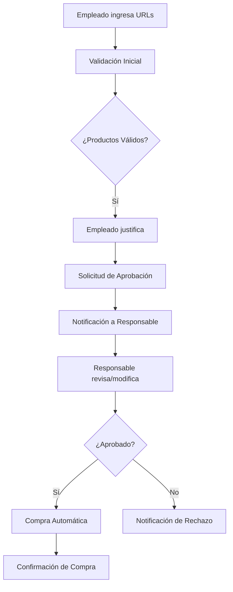

# Plan de Desarrollo - Sistema de Aprobación de Compras Amazon

## Resumen Ejecutivo
Desarrollo de un sistema de workflow para gestionar solicitudes de compra en Amazon corporativo, con validación automática, flujo de aprobación y compra automatizada usando Temporal.io.

## Arquitectura del Sistema

### Componentes Principales
1. **Formulario Web** - Interfaz para empleados
2. **Workflow de Temporal** - Orquestación del proceso
3. **Activities** - Validaciones, notificaciones, compras
4. **Base de datos** - Estado y configuración
5. **Amazon API Integration** - Validación de productos y compras

### Flujo del Proceso


## Tecnologías Seleccionadas

### Stack Principal
- **Temporal.io**: Orquestación de workflows (Go SDK)
- **Go**: Backend y workers
- **HTML/JavaScript**: Frontend simple para prototipo
- **SQLite**: Base de datos local para desarrollo
- **Docker**: Containerización del entorno

### APIs Externas
- **Amazon Product API**: Validación de productos
- **Email/Slack**: Notificaciones

## Estructura del Proyecto

```
temporal-workflow/
├── cmd/
│   ├── worker/           # Temporal worker
│   └── web/              # Servidor web
├── internal/
│   ├── workflows/        # Definiciones de workflows
│   ├── activities/       # Activities (validación, compra, etc.)
│   ├── models/          # Estructuras de datos
│   └── services/        # Servicios (Amazon, notificaciones)
├── web/                 # Frontend estático
├── docker-compose.yml   # Temporal server local
└── docs/               # Documentación
```

## Plan de Implementación por Fases

### Fase 1: Infraestructura Base (2-3 horas)
- [x] Configuración de Temporal local con Docker
- [x] Estructura básica del proyecto Go
- [x] Worker básico funcionando
- [x] Primer workflow simple

### Fase 2: Modelos y Workflow Principal (3-4 horas)
- [ ] Definición de estructuras de datos
- [ ] Workflow principal de aprobación
- [ ] Activities base (sin lógica completa)
- [ ] Tests unitarios básicos

### Fase 3: Integración Amazon (4-5 horas)
- [ ] Activity de validación de productos Amazon
- [ ] Parseo de URLs de productos
- [ ] Validaciones de negocio (duplicados, prohibidos)
- [ ] Activity de compra automática

### Fase 4: Sistema de Aprobaciones (3-4 horas)
- [ ] Flujo de notificaciones
- [ ] Interface para responsables
- [ ] Modificación de carritos por responsables
- [ ] Estados del workflow

### Fase 5: Frontend y Testing (3-4 horas)
- [ ] Interfaz web para empleados
- [ ] Dashboard para responsables
- [ ] Tests de integración
- [ ] Documentación de usuario

## Objetivos de Cada Fase

### Fase 1: Fundación Técnica
**Objetivo**: Tener Temporal funcionando localmente con un workflow básico
**Entregables**:
- Docker compose con Temporal server
- Worker Go ejecutándose
- Workflow de prueba funcionando
- Documentación de setup

### Fase 2: Core del Negocio
**Objetivo**: Workflow principal con todas las etapas definidas
**Entregables**:
- Modelo de datos completo
- Workflow de aprobación con todas las etapas
- Activities stub funcionando
- Tests unitarios de workflow

### Fase 3: Integración Externa
**Objetivo**: Conexión funcional con Amazon
**Entregables**:
- Validación real de productos Amazon
- Detección de duplicados y filtros
- Compra automática básica
- Manejo de errores de API

### Fase 4: Experiencia de Usuario
**Objetivo**: Flujo completo para usuarios finales
**Entregables**:
- Sistema de notificaciones
- Interface de aprobación
- Modificación de carritos
- Tracking de estados

### Fase 5: Pulimento y Deployment
**Objetivo**: Sistema listo para uso real
**Entregables**:
- Interface web completa
- Tests de integración
- Documentación completa
- Guía de deployment

## Consideraciones Técnicas

### Patrones Temporal
- **Long-running workflows**: Para procesos que pueden durar días
- **Activities con retry**: Para llamadas a APIs externas
- **Signals**: Para aprobaciones de responsables
- **Queries**: Para consultar estado del workflow

### Manejo de Estados
- **Carritos de compra**: Estado persistente en workflow
- **Aprobaciones**: Usando signals de Temporal
- **Notificaciones**: Activities asíncronas
- **Timeouts**: Para aprobaciones que tardan mucho

### Seguridad y Validación
- **URLs de Amazon**: Validación de formato y productos reales
- **Productos prohibidos**: Lista configurable
- **Límites de compra**: Por empleado/departamento
- **Logs de auditoría**: Todos los cambios registrados

## Métricas de Éxito
1. **Funcionalidad**: Workflow completo funcionando end-to-end
2. **Robustez**: Manejo de errores y reintentos
3. **Usabilidad**: Interfaces simples e intuitivas
4. **Observabilidad**: Logs y métricas del sistema
5. **Performance**: Respuesta en menos de 5 segundos

## Próximos Pasos
1. Configurar entorno Temporal local
2. Crear estructura básica del proyecto Go
3. Implementar primer workflow simple
4. Documentar progreso en DIARY.md

---
*Plan creado: 2025-07-22*
*Estimación total: 15-20 horas de desarrollo*